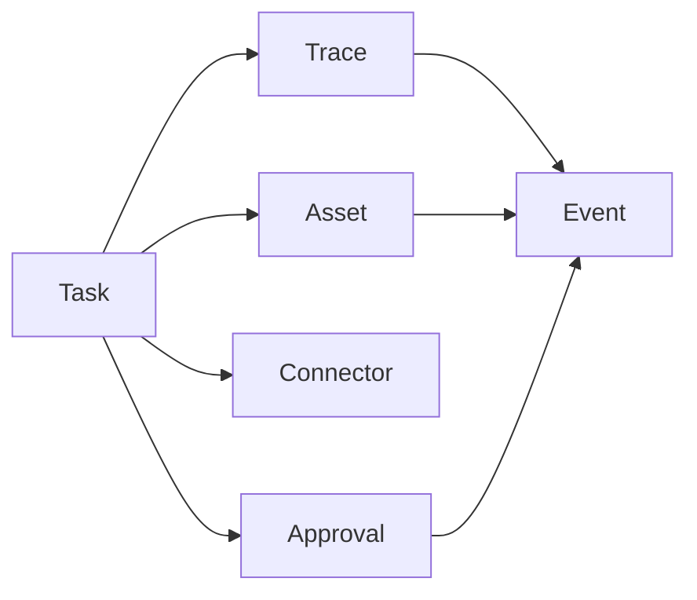

# 核心对象契约

## 0. 文档控制

- 版本：v0.1
- 状态：Draft
- 用途：把 MVP 必需对象从概念收敛为可验证 JSON Schema
- 适用对象：研发、测试、AI agent、产品
- 单一来源：本文件与 `schemas/` 目录
- 规范级别：MUST / SHOULD / MAY

## 1. 目标

本文件定义第一阶段最小闭环需要优先固化的核心对象：

- Task
- Approval
- Event
- Asset
- Connector
- Trace

这些对象是 `用户意图 -> 计划 -> 审批 -> 执行 -> 事件 -> 资产` 闭环的最低数据基础。

## 2. Schema 文件

| 对象 | Schema | 用途 |
| --- | --- | --- |
| Task | [schemas/task.schema.json](./schemas/task.schema.json) | 表达一次生产任务及其状态 |
| Approval | [schemas/approval.schema.json](./schemas/approval.schema.json) | 表达高风险动作的审批记录 |
| Event | [schemas/event.schema.json](./schemas/event.schema.json) | 表达不可变行为事件 |
| Asset | [schemas/asset.schema.json](./schemas/asset.schema.json) | 表达生产结果和来源链 |
| Connector | [schemas/connector.schema.json](./schemas/connector.schema.json) | 表达 DCC 连接器状态和能力 |
| Trace | [schemas/trace.schema.json](./schemas/trace.schema.json) | 表达一次执行链路的回放轨迹 |

## 3. 公共约束

- 所有核心对象 MUST 带有 `id`、`type`、`version`、`trace_id`。
- 所有会被展示或追踪的对象 SHOULD 带有 `created_at` 和 `updated_at`。
- 所有状态字段 MUST 使用枚举值，不允许任意字符串。
- 所有外部副作用 MUST 通过 Event、Trace 或 Approval 留痕。
- 所有可执行对象 SHOULD 能关联到 Task 或 Trace。

## 4. MVP 对象关系

## 5. 使用方式

- 研发 SHOULD 先根据这些 schema 生成 TypeScript 类型或后端 DTO。
- 测试 SHOULD 使用这些 schema 做契约测试。
- UI SHOULD 以这些字段为最小展示数据，不依赖临时 mock 字段。
- 后续新增对象时 SHOULD 先补 schema，再补页面和接口。

