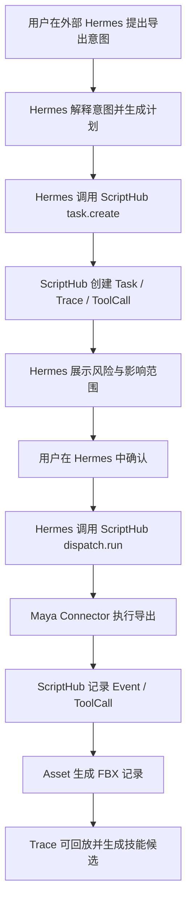

# MVP 闭环：Maya 导出 FBX

## 0. 文档控制

- 版本：v0.1
- 状态：Draft
- 用途：固定第一条可验证端到端生产闭环
- 适用对象：产品、设计、研发、测试、AI agent
- 单一来源：本文件
- 规范级别：MUST / SHOULD / MAY

## 1. 目标

本 MVP 闭环用于验证 Runtime 的最小价值：

用户在外部 Hermes 中提交“从 Maya 导出选中模型为 FBX”的意图后，Hermes 能通过 ScriptHub Tool Bridge 创建任务、暴露风险、请求审批、调度 Connector 执行导出。ScriptHub 控制台同步展示 ToolCall、执行状态、事件、Asset、Trace 和技能候选。

## 2. 非目标

- 不做完整 Maya 到 UE 发布链路
- 不做批量导出
- 不做复杂命名规则推理
- 不做自动修复模型问题
- 不做多 Agent 协同

## 3. 前置条件

- Runtime Host 已启动。
- Maya Connector 处于 `connected` 或 `available` 状态。
- 当前 Maya Session 中存在已选中的 mesh。
- Hermes 具备调用 ScriptHub Tool Bridge 的权限。
- 用户在 Hermes 对话中具备确认高风险动作的权限。
- 目标导出目录可写。

## 4. 用户意图

示例意图：

```text
把当前 Maya 里选中的模型导出成 FBX，放到项目 exports 目录。
```

## 5. 标准执行链路



## 6. 状态迁移

| 阶段 | Task 状态 | Approval 状态 | 说明 |
| --- | --- | --- | --- |
| 提交 | `draft` | `not_required` | Hermes 调用 `scriptHub.task.create` |
| 计划完成 | `planned` | `pending` | 系统识别到文件写入风险 |
| 审批通过 | `waiting_approval` -> `queued` | `approved` | 用户在 Hermes 中确认后，Hermes 调用审批工具 |
| 执行中 | `running` | `approved` | Connector 正在导出 |
| 成功 | `succeeded` | `approved` | FBX 资产生成 |
| 失败 | `failed` | `approved` | 错误进入可恢复判断 |

## 7. 最小计划内容

计划 MUST 至少展示：

- 目标操作：导出选中 Maya mesh 为 FBX。
- 目标 Connector：Maya Connector。
- 输出路径：用户指定路径或项目默认 `exports` 目录。
- 风险：写入文件系统、可能覆盖同名文件、导出结果依赖当前选择。
- 审批原因：涉及外部文件写入。
- 成功结果：生成一个 `asset_type = fbx` 的 Asset。

## 8. Tool 调用草案

```json
{
  "tool": "scriptHub.task.create",
  "version": "1.0.0",
  "input": {
    "conversation_id": "conv_hermes_fbx_001",
    "capability_id": "maya.export_fbx.v1",
    "metadata": {
      "selection": {
        "source": "maya.current_selection",
        "type": "mesh"
      },
      "output_path": "project://exports/selected_asset.fbx",
      "overwrite": false
    }
  },
  "requires_confirmation": true,
  "permissions": [
    "dcc.maya.read_selection",
    "filesystem.write"
  ]
}
```

## 9. 关键事件

| 事件 | 触发时机 | Level | 关联对象 |
| --- | --- | --- | --- |
| `task.created` | 创建 Task 后 | `info` | Task |
| `task.planned` | 计划生成后 | `info` | Task |
| `tool.invoked` | Hermes 调用 ScriptHub 工具时 | `audit` | ToolCall |
| `approval.requested` | 需要人工确认时 | `audit` | Approval |
| `approval.decided` | 用户在 Hermes 中批准或拒绝时 | `audit` | Approval |
| `dispatch.started` | Runtime 开始调度 Tool 时 | `info` | Task / Connector |
| `dispatch.completed` | Connector 返回成功时 | `info` | Task |
| `dispatch.failed` | Connector 返回失败时 | `error` | Task |
| `artifact.created` | FBX Asset 写入记录时 | `info` | Asset |
| `trace.checkpoint` | 每个关键节点 | `debug` | Trace |

## 10. 最小 UI 覆盖

| 页面 | 必须展示 |
| --- | --- |
| Agent Activity Console | 外部 Hermes 会话镜像、ToolCall 时间线、当前导出任务、Connector 健康、待审批提醒、技能候选 |
| 工作台 | 当前导出任务、Connector 健康、待审批提醒 |
| 任务中心 | 导出任务状态、风险等级、审批状态 |
| 任务详情 | 计划、审批记录、执行日志、错误和恢复入口 |
| Trace / Review / Approval | 风险说明、影响范围、批准/拒绝、Trace 时间线 |
| 资产详情 | FBX 文件、来源 Task、关联 Trace、版本状态 |
| 连接器面板 | Maya Connector 连接状态、最近错误 |

## 11. 失败路径

| 失败 | 错误类型 | 建议处理 |
| --- | --- | --- |
| 未选择 mesh | `validation_error` | 返回计划修改，提示用户选择对象 |
| 输出目录不可写 | `permission_error` | 进入审批或请求改路径 |
| Connector 断开 | `availability_error` | 自动重连，失败后暂停任务 |
| Maya 无响应 | `timeout_error` | 标记为可恢复失败，保留 Trace |
| 文件已存在 | `conflict_error` | 请求用户确认覆盖或改名 |
| 导出结果不确定 | `incomplete_result` | 进入 `needs_review` |

## 12. 验收标准

- Hermes 能通过 Tool Bridge 提交导出任务。
- 用户能在 Hermes 对话中看到系统生成的计划和风险说明。
- 高风险文件写入必须进入审批。
- 用户在 Hermes 对话中确认后，任务进入执行状态。
- Connector 成功后生成 FBX Asset 记录。
- 任务详情能展示 Event 和 Trace。
- 失败时必须显示错误类型和下一步动作。
- Agent Activity Console 能展示对应 ToolCall 和技能候选。

## 13. 测试用例

| 用例 | 输入 | 期望 |
| --- | --- | --- |
| 正常导出 | 选中 mesh，目录可写 | Task 成功，Asset 生成 |
| 无选择 | 未选中对象 | 计划失败或等待用户补充 |
| 拒绝审批 | 审批选择拒绝 | Task 取消或回到计划态 |
| Connector 断线 | 执行前断开 | Task 暂停并提示重连 |
| 输出冲突 | 文件已存在 | 进入人工确认 |
