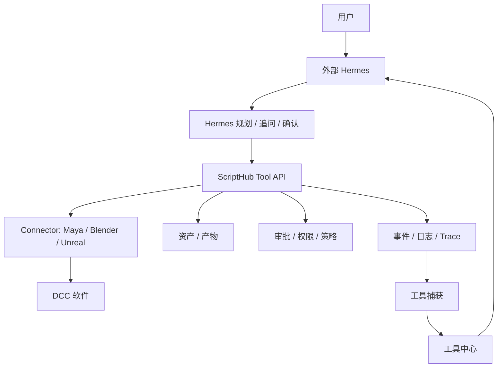

# ScriptHub Tool Bridge Contract

> 本文定义 Hermes 接入方向：用户只在外部 Hermes 中自然语言对话，ScriptHub 作为 Hermes 可调用的平台工具层、跨 DCC 工具中心、运行记录器、安全确认层和工具改进层。原先“前端直接提交结构化任务给 Hermes”的 adapter 方案降级为调试和兼容路径。

## 1. 产品定位

目标不是让用户在 ScriptHub 表单里创建任务，也不是让 ScriptHub 内置主聊天入口，而是让用户直接在外部 Hermes 中表达创作意图。ScriptHub 的用户价值不是“多一个控制台”，而是在统一工具中心里管理可复用生产能力。插件、脚本和 Hermes 沉淀工具不再作为一级分类；它们只是统一 Tool 的不同来源或运行形态。所有工具都通过同一套参数、安全确认、运行历史、产物来源和 Hermes 修复体系执行。

```text
用户自然语言
  -> 外部 Hermes Agent
  -> ScriptHub 平台工具 API
  -> Connector / DCC / 资产 / 审批 / 审计
  -> 执行过程记录
  -> 工具中心: 可复用生产能力
  -> 工具参数 / 运行历史 / Hermes 修复 / 产物来源
  -> 工具版本与持续改进
```

外部 Hermes 的角色：

- 理解用户意图。
- 拆解执行步骤。
- 调用 ScriptHub 暴露的平台工具。
- 必要时向用户追问或请求确认。
- 观察执行结果和错误。
- 将成功路径沉淀为可复用 Hermes 工具，并在后续修复中继续改进工具。
- 在工具足够稳定时，可协助生成插件 / 脚本工具并注册到 ScriptHub。

ScriptHub 的角色：

- 提供可调用的平台工具。
- 记录 Hermes 对话来源、工具调用、执行状态和确认点。
- 为个人用户展示工具中心、工具类型、工具参数、运行历史、产物、Hermes 修复和安全确认。
- 记录任务、事件、资产、日志和决策。
- 从执行历史中抽取技能候选。
- 管理技能版本、权限、风险等级和复用效果。

## 1.1 用户可见产品层

个人用户默认不需要理解 ToolCall、descriptor、trace_id 或 audit_id。ScriptHub 的默认界面应围绕以下对象组织：

- 工具中心：统一展示可复用生产能力，默认按能力分类、DCC、成熟度组织。
- 来源 / 运行形态：Hermes 沉淀、脚本、DCC 插件、外部服务或组合流程，只作为标签展示。
- 成熟度：草稿、可用、稳定、已验证、团队推荐。
- 工具参数：用户可调整的路径、范围、命名、覆盖策略和高级选项。
- 运行历史：每次工具运行做了什么、结果如何、产物在哪里。
- Hermes 修复：失败时 Hermes 如何介入、修了什么、是否增强工具。
- 安全确认：会读取什么、会写入什么、是否覆盖文件、风险等级、能否回滚。
- 产物：生成了哪些文件、在哪里、来自哪次操作。
- 工具版本：工具参数、步骤、失败处理和验证结果的变化记录。

ToolCall、Trace、Audit、权限矩阵、descriptor registry 和契约校验属于高级视图、团队治理和排障层。

## 1.2 工具对象

用户层统一表达为 Tool。Tool 的一级组织维度是能力分类、运行环境和成熟度；`source` 只表示工具来源或运行形态，例如 Hermes 沉淀、脚本、DCC 插件、外部服务或组合流程。

- 工具名称：用户能理解的名称，例如“导出当前选择为 FBX”。
- 能力分类：DCC 操作、资产处理、项目自动化、检查与修复、流程助手。
- 成熟度：草稿、可用、稳定、已验证、团队推荐。
- 来源 / 运行形态：Hermes 沉淀、脚本、DCC 插件、外部服务或组合流程。
- 运行时：Maya、Blender、Unreal、文件系统或组合流程。
- 触发方式：按钮名称、Hermes 触发话术和适用条件。
- 参数模板：输入对象、输出路径、命名规则、覆盖策略和可扩展参数。
- 工具链：所需 ScriptHub 工具、Connector 和 DCC 能力。
- 安全边界：读取范围、写入范围、风险等级、所需确认和权限。
- Hermes 修复策略：常见错误、自动修复动作、需要用户介入的情况。
- 产物来源：产物、版本、来源会话、trace 和运行记录。
- 运行历史：每次运行的参数、结果、错误和修复。
- 工具版本：工具何时新增参数、修改步骤、增强失败处理或发布。

底层仍可以用 SkillCandidate、Workflow、Trace、ToolCall、script manifest 或 plugin manifest 表示，但用户层应表达为“工具”。

## 2. 新的主链路



## 3. 当前代码的重新定位

现有代码不废弃，但职责需要改名和降级：

- `runtimeAdapter.ts`：从“前端调用 Hermes 的 adapter”调整为“ScriptHub 平台工具桥”的实现边界。
- `hermesAdapter.ts`：后续不应只表示 HTTP 后端 adapter，而应成为 Hermes 对话 / 工具调用桥的候选实现。
- `runtimeController.ts`：继续负责 UI 状态协调，但新增外部 Hermes 活动镜像、工具调用态、技能捕获态。
- `CapabilityRegistry`：从“可创建任务的能力列表”升级为“Hermes 可发现和可调用的平台工具目录”；个人层另行展示“工具中心”。
- `CreateTaskPanel`：保留为结构化调试入口，不再是主要用户入口。
- `WorkflowPage`、`AuditPage`、`EvaluationDashboard`：成为技能回放、执行解释和效果评估的基础页面。

## 4. 平台工具 API

Hermes 后续主要调用 ScriptHub 工具，而不是被动接收前端任务。

建议第一批工具：

```ts
type PlatformTool =
  | 'connector.health.get'
  | 'connector.capability.list'
  | 'task.create'
  | 'task.status.get'
  | 'approval.request'
  | 'approval.decide'
  | 'asset.register'
  | 'asset.list'
  | 'asset.version.get'
  | 'event.trace.get'
  | 'skill.candidate.create'
  | 'skill.register';
```

工具调用记录至少包含：

```ts
type ToolCallRecord = {
  id: string;
  conversation_id: string;
  trace_id: string;
  tool_name: string;
  status: 'pending' | 'running' | 'succeeded' | 'failed' | 'needs_approval';
  input: unknown;
  output?: unknown;
  error?: string;
  started_at: string;
  finished_at?: string;
};
```

## 5. 外部 Hermes 活动镜像对象

ScriptHub 只镜像外部 Hermes 活动，不承担正式聊天输入。后续需要新增或映射这些对象：

```ts
type HermesConversation = {
  id: string;
  title: string;
  status: 'active' | 'waiting_user' | 'running' | 'completed' | 'failed';
  trace_id: string;
  created_at: string;
  updated_at: string;
};

type HermesMessage = {
  id: string;
  conversation_id: string;
  role: 'user' | 'hermes' | 'system' | 'tool';
  content: string;
  created_at: string;
  tool_call_id?: string;
};
```

## 6. 工具对象与沉淀对象

每次对话执行都应尝试产生工具候选，而不是只结束为一次任务。底层可继续使用 SkillCandidate 作为 Hermes 工具的实现对象，也可以使用 manifest 表示插件 / 脚本工具。用户层必须映射为统一 Tool。

```ts
type SkillCandidate = {
  id: string;
  source_conversation_id: string;
  source_trace_id: string;
  name: string;
  summary: string;
  trigger_examples: string[];
  steps: SkillStep[];
  required_tools: string[];
  required_permissions: string[];
  risk_level: 'low' | 'medium' | 'high';
  status: 'draft' | 'reviewing' | 'validated' | 'published' | 'rejected';
  created_at: string;
};

type SkillStep = {
  order: number;
  intent: string;
  tool_name?: string;
  input_template?: unknown;
  approval_required?: boolean;
  failure_handling?: string;
};
```

用户层建议对象：

```ts
type ToolSource = 'hermes_captured' | 'script' | 'dcc_plugin' | 'external_service' | 'composed_workflow';
type ToolRuntime = 'maya' | 'blender' | 'unreal' | 'filesystem' | 'multi_app';
type ToolCategory = 'dcc_operation' | 'asset_processing' | 'project_automation' | 'inspection_repair' | 'workflow_assistant';
type ToolMaturity = 'draft' | 'usable' | 'stable' | 'verified' | 'team_recommended';

type UserTool = {
  id: string;
  name: string;
  description: string;
  category: ToolCategory;
  maturity: ToolMaturity;
  source: ToolSource;
  runtime: ToolRuntime;
  source_conversation_id: string;
  source_trace_id: string;
  script_manifest_id?: string;
  skill_candidate_id?: string;
  status: 'draft' | 'usable' | 'improving' | 'verified' | 'archived';
  parameters: ToolParameter[];
  runs: ToolRun[];
  repair_history: HermesRepair[];
  versions: ToolVersion[];
};

type ToolParameter = {
  key: string;
  label: string;
  type: 'string' | 'boolean' | 'number' | 'enum' | 'path';
  default_value: unknown;
  required: boolean;
  safety_note?: string;
};

type ToolRun = {
  id: string;
  tool_id: string;
  conversation_id: string;
  trace_id: string;
  status: 'waiting_confirmation' | 'running' | 'succeeded' | 'failed' | 'repaired';
  parameters: Record<string, unknown>;
  artifact_ids: string[];
  error_id?: string;
  repair_id?: string;
  created_at: string;
};

type HermesRepair = {
  id: string;
  tool_id: string;
  run_id: string;
  problem: string;
  hermes_action: string;
  user_action_required?: string;
  result: 'fixed' | 'needs_user' | 'failed';
  tool_change?: string;
};

type ToolVersion = {
  version: string;
  tool_id: string;
  changes: string[];
  source_repair_id?: string;
  verified_by_run_id?: string;
  created_at: string;
};

type ScriptToolManifest = {
  id: string;
  tool_id: string;
  runtime: Exclude<ToolRuntime, 'multi_app'>;
  entrypoint: string;
  language: 'python' | 'mel' | 'blueprint' | 'javascript' | 'shell';
  install_scope: 'scriptHub' | 'dcc_plugin' | 'local_script';
  checksum: string;
  permissions: string[];
  parameter_schema: unknown;
};
```

DCC 插件 / 脚本来源约束：

- `script` 和 `dcc_plugin` 来源的工具也必须进入 ToolRun、SafetyConfirm、Artifact 和 HermesRepair 体系。
- `script` 和 `dcc_plugin` 来源的工具不得绕过 Connector 直接写本地状态。
- 如果脚本或 DCC 插件执行失败，Hermes 可以读取错误、提出修复、生成新版本或回退到上一个版本。
- DCC 内可以只安装轻量 Connector；复杂参数面板和运行历史默认放在 ScriptHub 的桌面级工具小窗中。纯浏览器环境可以使用 Web 内预览作为 fallback，但最终产品目标是独立置顶窗口。

## 7. 前端优先级

新的前端优先级：

1. 新增 `ToolCenter`：统一展示可复用生产能力，支持按能力分类、DCC、成熟度、最近运行和状态筛选；来源只作为标签展示。
2. 新增 `ToolFloatingWindow`：桌面级置顶工具小窗，由用户点击某个工具后打开，承载参数编辑、安全确认、执行状态、产物和 Hermes 修复；Web MVP 可用 `ToolInlinePanel` 降级预览。
3. 新增 `ToolLibrary`：统一展示 Hermes 沉淀、脚本、DCC 插件、外部服务和组合流程来源的工具，并使用同一套 ToolCard / ToolRun 模型。
4. 新增 `ToolParameters` / `SafetyConfirm`：运行工具前展示并允许调整参数，同时解释读取、写入、覆盖、风险和确认状态。
5. 新增 `ArtifactShelf` / `HermesRepairLog`：让用户围绕产物和 Hermes 修复动作继续运行或完善工具。
6. `AgentActivityConsole` / `HermesActivityConsole` 降为高级视图，用于镜像外部 Hermes 会话、当前控制会话和 trace 状态。
7. `ToolCallTimeline` 降为高级视图，用于展示 Hermes 正在调用哪些平台工具、输入输出摘要、失败原因和审批点。
8. `SkillCapturePanel` 在个人层表达为“工具候选 / 工具改进建议”，高级层保留 SkillCandidate 状态和 ToolCall 详情。
9. 将现有任务、审批、Connector、资产、审计页面接入同一个 `conversation_id` / `trace_id`。
10. 保留结构化任务创建作为调试入口。
11. 移除或隐藏正式聊天输入框；若保留输入，只能标记为 mock / 调试。

## 8. 当前 mock 覆盖状态

当前前端 mock 已覆盖：

- `scriptHub.connector.health.get`：模拟外部 Hermes 查询 Connector 健康状态。
- `scriptHub.task.create`：模拟外部 Hermes 创建导出任务，并关联 `task_id`、`approval_id`、`trace_id`。
- `scriptHub.approval.decide`：模拟外部 Hermes 根据用户对话提交批准或拒绝。
- `scriptHub.asset.register`：模拟导出产物登记，并写入 asset / provenance / trace 关联。
- `scriptHub.skill.candidate.create`：模拟根据 ToolCall 序列写入技能候选草稿。

当前 mock 失败路径覆盖：

- Connector 不可用。
- `task.create` 失败。
- `approval.decide` 失败。

当前只读控制台覆盖：

- Agent Activity：镜像外部 Hermes 消息和 Tool Bridge 活动。
- ToolCall Timeline：展示工具调用并可查看 input / output / error / trace。
- Audit：合并 runtime event、External Hermes message、Tool Bridge ToolCall，并支持来源筛选与关键词过滤。
- Skill Capture：展示技能候选来源、风险、权限、触发样例和开发态状态流转。
- DevTools：集中管理开发态调试任务、Tool Bridge 成功/失败场景、审批模拟。
- Asset Provenance：展示 External Hermes、ToolCall、Task、Approval、Asset、Trace 的来源链。

## 9. 兼容现有 adapter

当前已经实现的接口仍可保留，用作平台工具的底层能力：

- `getConnectorHealth` -> `connector.health.get`
- `listCapabilities` -> `connector.capability.list`
- `submitTask` -> `task.create`
- `decideApproval` -> `approval.decide`
- `runtimeEvents` -> `event.trace.get`

重要约束：

- 页面模块不直接调用 Hermes。
- Hermes 也不直接绕过 ScriptHub 操作本地状态。
- Hermes 通过平台工具 API 调用 ScriptHub，ScriptHub 负责记录、审计和技能沉淀。
- 所有工具调用都必须进入 trace，后续才能回放和提炼技能。

## 10. 真实外部 Hermes 传输候选

外部 Hermes 调用 ScriptHub Tool Bridge 时，第一版必须支持可演进的传输边界。传输层只负责连接、鉴权、请求封装和结果返回；工具语义、审计字段和错误模型必须在三种传输中保持一致。

### 10.1 MCP Server

- 定位：首选正式集成方式。ScriptHub 暴露为 MCP server，Hermes 作为 MCP client 发现和调用工具。
- 适用场景：Hermes 具备 MCP client 能力，需要动态工具发现、标准工具调用语义、较低耦合和长期可扩展性。
- 发现方式：Hermes 通过 MCP `tools/list` 获取 ScriptHub 工具目录。
- 调用方式：Hermes 通过 MCP `tools/call` 调用单个工具。
- 返回方式：ScriptHub 返回结构化 tool result，并在结果中带回 `tool_call_id`、`trace_id`、`status`、`output` 或 `error`。
- 优点：贴近 Agent 工具协议，便于后续增加资源、提示模板、能力目录和多客户端接入。
- 风险：Hermes 端必须稳定支持 MCP；本地部署、鉴权和长连接监控需要额外运维约定。

前端 MVP 已提供本地 MCP adapter skeleton：

- `toolsList()`：返回 descriptor registry 的 MCP 发现视图。
- `toolsCall(request)`：将 MCP `name`、`arguments`、`_meta` 转为统一 `ToolBridgeCallRequest`。
- `toolsCall()` 复用 HTTP fallback handler 的 `callTool()`，返回 `content`、`isError`、`structuredContent`。
- `structuredContent` 保持为统一 `ToolBridgeCallResult`，用于后续审计、trace 和 HTTP fallback 结果一致性。
- `_meta` 可携带 `caller_agent_id`、`caller_agent_name`、`caller_agent_version`、`caller_agent_scopes`、`auth_token_hint`，用于真实 Hermes client 接入前的 caller scope / auth 占位。`auth_token_hint` 只能存储 token 指纹或别名，不得存储 token 原文。

该 adapter 当前用于验证 MCP 语义映射，后续可以包成真实 MCP server endpoint。

### 10.2 HTTP API

- 定位：第一版 fallback 和调试兼容方式。
- 适用场景：Hermes 暂不支持 MCP、需要跨语言调用、需要通过网关或云端服务调用 ScriptHub。
- 发现方式：`GET /tool-bridge/tools`
- 调用方式：`POST /tool-bridge/calls`
- 查询方式：`GET /tool-bridge/calls/{tool_call_id}`，用于异步或长任务轮询。
- 返回方式：统一 `ok/data/error/trace_id/timestamp` 响应包。
- 优点：实现和排障简单，易接入现有后端、测试工具和 API 网关。
- 风险：需要自行维护工具发现语义，和 MCP 的工具 schema 要保持一致，避免出现双份契约。

前端 MVP 已提供本地 HTTP fallback handler skeleton：

- `listTools()`：返回 descriptor registry 的 HTTP 发现视图。
- `callTool(request)`：复用 descriptor 校验，返回统一 `ToolCallResult`，并写入内存调用记录。
- `getToolCall(tool_call_id)`：按调用 ID 查询最近 handler 结果。
- `listToolsResponse()`、`callToolResponse()`、`getToolCallResponse()`：返回更接近真实 HTTP route 的 `ok`、`data`、`error`、`trace_id`、`timestamp` 响应包。

该 handler 当前用于开发态验证契约形状，后续可以迁移为真实 HTTP route 或由 MCP `tools/call` 复用。

### 10.3 Local Bridge

- 定位：本机 DCC / Connector 调试和离线执行候选，不作为第一版正式远程集成主路径。
- 适用场景：Hermes 与 ScriptHub 运行在同一工作站，需要本地进程间通信、开发态模拟、DCC 插件桥接或无公网环境。
- 发现方式：读取本地 manifest 或通过本地 bridge 进程暴露 `tools/list` 等价能力。
- 调用方式：stdin/stdout JSON-RPC、本地 socket、named pipe 或 loopback HTTP 之一。
- 返回方式：必须映射为同一份 ToolCallResult，不允许绕过 ScriptHub 审计。
- 优点：适合 DCC 工作站、离线演示和调试。
- 风险：平台差异、权限边界和进程生命周期复杂；不能让 Hermes 直接操作本地状态。

## 11. 工具发现契约

工具发现返回的是 Hermes 可调用的平台工具目录，而不是前端菜单或内部函数列表。

```ts
type ToolDescriptor = {
  name: string;
  title: string;
  version: string;
  description: string;
  input_schema: unknown;
  output_schema: unknown;
  permissions: string[];
  risk_level: 'low' | 'medium' | 'high';
  approval_required: boolean;
  idempotent: boolean;
  retryable: boolean;
  timeout_ms: number;
  owner: string;
  tags: string[];
};
```

发现约束：

- 工具名必须稳定，建议使用 `scriptHub.<domain>.<action>`。
- `input_schema` 和 `output_schema` 必须作为 MCP 与 HTTP 的单一语义来源。
- 高风险工具必须声明 `approval_required: true`。
- 废弃工具必须保留一个兼容窗口，并通过 `tags` 或后续字段标记 deprecated。

### 11.1 当前 Descriptor Registry

前端 MVP 已建立 `src/services/toolBridgeDescriptors.ts` 作为第一版工具发现单一来源，当前覆盖：

| 工具 | 风险 | 审批 | 权限 | 说明 |
| --- | --- | --- | --- | --- |
| `scriptHub.connector.health.get` | low | false | `connector:read` | 查询 Connector 健康状态 |
| `scriptHub.task.create` | high | true | `task:create` | 从外部 Hermes 意图创建 ScriptHub 任务 |
| `scriptHub.approval.decide` | high | false | `approval:decide` | 写入用户已确认的审批决策 |
| `scriptHub.asset.register` | low | false | `asset:register` | 登记导出资产并关联 provenance |
| `scriptHub.skill.candidate.create` | low | false | `skill_candidate:create` | 基于 ToolCall trace 创建或更新技能候选草稿 |
| `scriptHub.skill.candidate.save_draft` | low | false | `skill_candidate:update` | 保存技能候选草稿 |
| `scriptHub.skill.candidate.submit_review` | medium | false | `skill_candidate:submit_review` | 将技能候选送审 |
| `scriptHub.skill.candidate.reject` | medium | false | `skill_candidate:review` | 拒绝送审中的技能候选 |
| `scriptHub.skill.candidate.publish` | high | true | `skill_candidate:publish` | 发布已审核技能候选 |

该 registry 同时生成：

- MCP `tools/list` 视图：`name`、`title`、`description`、`inputSchema`。
- HTTP `GET /tool-bridge/tools` fallback 视图：完整 descriptor。

契约要求：MCP 与 HTTP 的工具名和 input schema 必须来自同一份 descriptor，不允许复制两份 schema。

## 12. 工具调用契约

```ts
type ToolCallRequest = {
  tool_name: string;
  tool_version?: string;
  conversation_id: string;
  trace_id?: string;
  parent_tool_call_id?: string;
  caller_agent: {
    id: string;
    name: string;
    version?: string;
    scopes?: string[];
    auth_token_hint?: string;
    transport: 'mcp' | 'http' | 'local_bridge';
  };
  input: unknown;
  idempotency_key?: string;
  dry_run?: boolean;
  requested_at: string;
};

type ToolCallResult = {
  tool_call_id: string;
  conversation_id: string;
  trace_id: string;
  tool_name: string;
  status: 'queued' | 'running' | 'succeeded' | 'failed' | 'needs_approval' | 'cancelled';
  output?: unknown;
  error?: ToolCallError;
  audit: ToolCallAudit;
  started_at: string;
  finished_at?: string;
};
```

调用约束：

- ScriptHub 必须先通过 descriptor registry 校验 `tool_name`，未登记工具返回 `not_found`。
- 若传入 `tool_version`，ScriptHub 必须校验其与 descriptor version 一致；不一致返回 `version_mismatch`。
- `caller_agent.transport` 必须存在于 descriptor 的 `supported_transports` 中，否则返回 `unsupported_transport`。
- `input` 必须通过 descriptor `input_schema` 校验；缺少必填字段、类型不匹配、枚举值不合法或出现禁止的额外字段时返回 `invalid_input`。
- ScriptHub 必须在接收调用时生成或继承 `trace_id`。
- Hermes 可以传入 `idempotency_key`，ScriptHub 应用于防重复提交。
- 长任务可以先返回 `queued` 或 `running`，再通过订阅、轮询或 trace 查询获得最终状态。
- `dry_run` 只做校验、权限检查和风险评估，不执行外部副作用。

## 13. 返回、错误和审计字段

```ts
type ToolCallError = {
  code:
    | 'invalid_input'
    | 'permission_denied'
    | 'approval_required'
    | 'connector_unavailable'
    | 'timeout'
    | 'execution_failed'
    | 'result_uncertain'
    | 'conflict'
    | 'not_found'
    | 'unsupported_transport'
    | 'version_mismatch';
  message: string;
  recoverable: boolean;
  retry_after_ms?: number;
  affected_scope?: string;
  detail?: unknown;
};

type ToolCallAudit = {
  audit_id: string;
  actor_type: 'external_hermes' | 'scriptHub' | 'user' | 'system';
  actor_id: string;
  caller_agent_id: string;
  auth_token_hint?: string;
  transport: 'mcp' | 'http' | 'local_bridge';
  scopes: string[];
  source_ip?: string;
  user_confirmation_id?: string;
  approval_id?: string;
  permissions_checked: string[];
  risk_level: 'low' | 'medium' | 'high';
  policy_decision: 'allow' | 'deny' | 'needs_approval';
  event_ids: string[];
  created_at: string;
};
```

审计约束：

- 每次工具发现可以记录轻量 audit；每次工具调用必须记录完整 audit。
- `ToolCallRecord`、`Event`、`Audit` 必须能通过 `trace_id` 串联。
- 审批、资产登记、Connector 执行等有副作用操作必须保留输入摘要、输出摘要和错误摘要。
- 审计记录中不得存储不必要的密钥、token 或完整敏感资产内容。

## 14. 第一版接入建议

第一版建议采用 MCP 优先、HTTP fallback：

- MCP 作为正式 Hermes 接入面，承载工具发现和工具调用。
- HTTP 作为 fallback、契约测试、开发调试和 MCP 不可用时的兼容入口。
- Local Bridge 只作为本机 DCC / Connector 开发态能力，不作为第一版正式外部 Hermes 主入口。
- 三种传输共享同一份工具 descriptor、调用 request、调用 result、错误模型和审计字段。
- 前端开发态通过 `VITE_TOOL_BRIDGE_PROVIDER=mock|mcp|http` 选择 Tool Bridge provider；当前 `mcp` / `http` provider 先作为 transport skeleton，继续复用同一套 ToolCall 记录和 trace 语义，后续再替换为真实 MCP server / HTTP route 调用。
- 真实服务边界、HTTP route、MCP server、Hermes client adapter 与前端 service 的职责切分见 `21-Real-Integration-Boundaries.md`。

## 15. 下一步契约待定

后续需要补充：

- Tool descriptor registry：工具名、版本、输入输出 schema、风险等级、审批要求和 transport 支持范围的单一来源。
- 外部 Hermes 活动镜像接口：同步 conversation、message、tool_call 和 trace 状态。
- MCP server 暴露细节：server 名称、工具命名、鉴权方式、连接生命周期和工具 schema 发布位置。
- HTTP fallback 路由细节：鉴权、幂等、异步回调、轮询和契约测试样例。
- 技能候选生成规则：哪些对话可沉淀，哪些必须人工确认。
- 技能发布流程：草稿、审核、验证、发布、废弃。
- 权限边界：哪些工具需要人工确认，哪些可自动执行。
