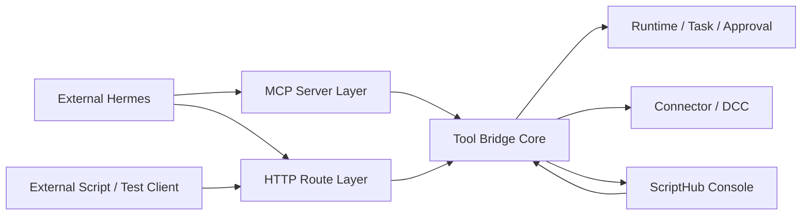

# Real Integration Boundaries

> 本文定义 ScriptHub 从前端 MVP 走向真实 Hermes / HTTP / MCP 链路时的服务边界。目标是避免把前端 mock、后端 HTTP route、MCP server、Hermes client adapter 和 DCC Connector 混成一层。

桌面级工具小窗属于 Desktop Shell 边界，不属于 HTTP / MCP / Hermes 协议层。窗口 API、置顶、拖动缩放、位置记忆和 Web fallback 详见 [22-Desktop-Floating-Window-Plan.md](./22-Desktop-Floating-Window-Plan.md)。

## 1. 当前结论

第一版真实链路建议按两阶段推进：

1. 先打通 HTTP fallback：外部脚本或 Hermes 通过 HTTP 调用 ScriptHub。
2. 再打通 MCP server：Hermes 通过 MCP `tools/list` 和 `tools/call` 调用同一套工具核心。

HTTP 和 MCP 必须共享：

- Tool Descriptor Registry。
- Tool Bridge call request / result。
- input schema 校验。
- idempotency 行为。
- audit / trace 字段。
- permission / risk / approval 元数据。

当前仓库已提供第一版本地 HTTP Tool Bridge 验证入口：

- `npm run tool-bridge:server`：启动本地 HTTP Tool Bridge，默认端口 `8787`。
- `npm run tool-bridge:demo`：模拟外部 Hermes client，调用 `scriptHub.task.create` 和 `scriptHub.asset.register`。

当前仓库也提供第一版 Maya Connector 本地验证入口：

- `npm run maya-connector:server`：启动本地 Maya Connector 验证服务，默认端口 `8795`。
- `npm run maya-connector:demo`：按“读取选择 -> 创建 ScriptHub 任务 -> 导出 FBX -> 登记产物”的顺序跑通最小链路。

这个 Maya Connector 服务现在支持两种模式：

- `fixture`：默认模式。返回一组可配置的模拟 Maya 选择对象，并在本地写出一个 FBX 占位文件，用来验证 Connector 边界、Tool Bridge 调用和产物登记是否能串起来。
- `maya_python_command`：设置 `SCRIPTHUB_MAYA_PYTHON_COMMAND` 后启用。HTTP 服务会调用 `scripts/maya_connector_command.py`，由 Maya Python 读取当前选择并执行 FBX export。

`fixture` 不是生产 Maya 插件，也不会真正调用 Maya Python 或写出真实 FBX 二进制；`maya_python_command` 是真实 Maya 接入的命令桥边界。实际生产接入时应把 `SCRIPTHUB_MAYA_PYTHON_COMMAND` 指向 `mayapy` 或一个能在 Maya 会话内执行 Python 的命令。

当前 HTTP server 是本地开发验证服务，默认将 ToolCall 写入 `.scripthub/tool-bridge-calls.json`，并可通过 `SCRIPTHUB_TOOL_BRIDGE_STORE` 指定存储路径。它能在服务重启后恢复 ToolCall 和 `idempotency_key` 映射，但不承担真实鉴权或生产部署职责。

最小验证路径：

```text
外部 demo client
  -> POST /tool-bridge/calls: scriptHub.task.create
  -> 返回 task_id / approval_id / trace_id
  -> POST /tool-bridge/calls: scriptHub.asset.register
  -> 返回 asset_id / storage_uri / trace_id
```

当前已把这个 HTTP 调用结果同步到前端 Agent Activity / ToolRun 视图，并开始反向驱动前端运行态。

当前前端已能轮询本地 HTTP Tool Bridge：

- `GET /tool-bridge/calls` 返回当前已恢复 / 已写入的外部 ToolCall 列表。
- `src/services/toolBridgeHttpActivity.ts` 将 HTTP ToolCall 映射为 UI 使用的 `ToolCallRecord`。
- `runtimeController` 会定时轮询本地 HTTP Tool Bridge；如果服务未启动，则静默跳过，不影响前端开发。
- 新增外部 ToolCall 会合并进 Agent Activity / ToolCall Timeline，并追加一条 tool 消息。
- `scriptHub.task.create` 外部调用会同步更新当前 Task、Approval、Session 和安全确认入口。
- `scriptHub.asset.register` 外部调用会同步更新当前 Asset。
- `runtimeController` 会记录已处理过的外部 HTTP ToolCall id，避免轮询重复应用。
- Agent Activity 和 DevTools 会显示本地 HTTP Tool Bridge 连接 / 同步状态，包括最后检查时间、最后同步时间、同步调用数和最近错误。

当前仍未完成：

- 当前同步仍是前端运行态同步，尚未接入后端真实 `Task` / `Approval` / `Asset` 持久化 store。
- HTTP Bridge 同步状态尚未写入审计或诊断事件。
- 真实 DCC 执行链路已具备 Maya Python 命令桥入口，但尚未在真实 Maya 环境中完成验证；默认 fixture 模式仍只写出本地占位 FBX。
- 本地 ToolCall store 尚未提供清理、归档、加密或多用户隔离策略。

## 2. 分层边界



## 3. 职责切分

### 3.1 Frontend Service

当前位置：

- `src/services/toolBridgeDescriptors.ts`
- `src/services/toolBridgeInvocation.ts`
- `src/services/toolBridgeHttpFallback.ts`
- `src/services/toolBridgeMcpAdapter.ts`
- `src/services/toolBridgeProviderFactory.ts`

职责：

- 在 MVP 阶段验证契约、schema、审计摘要和 DevTools 场景。
- 为真实 route / MCP server 提供可迁移的核心逻辑。
- 驱动前端 Agent Activity、ToolCall Timeline、Audit、Skill Capture 展示。

禁止：

- 不承担真实鉴权。
- 不直接暴露给外部 Hermes。
- 不绕过 ScriptHub trace / audit 写入状态。

迁移原则：

- descriptor、validation、request/result 类型可以迁移到 shared package 或后端 common 模块。
- UI 只消费 ToolCall / Audit / Activity mirror，不直接持有外部协议细节。

### 3.2 HTTP Route Layer

未来真实路由：

- `GET /tool-bridge/tools`
- `POST /tool-bridge/calls`
- `GET /tool-bridge/calls/{tool_call_id}`

职责：

- 接收外部 Hermes 或测试脚本 HTTP 调用。
- 做 HTTP 鉴权、rate limit、caller scope 解析。
- 调用 Tool Bridge Core。
- 返回 `ok / data / error / trace_id / timestamp` 响应包。

必须复用：

- descriptor registry。
- input schema validation。
- idempotency key。
- audit / trace 写入。

禁止：

- 不维护另一份工具 schema。
- 不在 route 里硬编码单个工具业务逻辑。
- 不返回和 MCP 不一致的工具语义。

### 3.3 MCP Server Layer

未来真实 MCP 能力：

- `tools/list`
- `tools/call`

职责：

- 将 MCP client 请求映射为统一 `ToolBridgeCallRequest`。
- 将 Tool Bridge Core 返回映射为 MCP result。
- 处理 MCP session、caller identity 和连接生命周期。
- 从 MCP `_meta` 中解析 caller scope，占位字段包括 `caller_agent_id`、`caller_agent_name`、`caller_agent_version`、`caller_agent_scopes`、`auth_token_hint`。

必须复用：

- `tools/list` 直接来自 descriptor registry。
- `tools/call` 复用 Tool Bridge Core。
- 错误模型和 trace 字段与 HTTP fallback 保持一致。
- 审计记录只保存 caller scope 与 token hint，不保存 token 原文。

禁止：

- 不维护另一套 MCP-only schema。
- 不绕过 HTTP fallback 已验证过的校验与审计逻辑。

### 3.4 Tool Bridge Core

当前已具备的核心能力：

- descriptor registry。
- call request / result 类型。
- schema validation。
- HTTP fallback handler。
- MCP adapter skeleton。
- idempotency key 复用。
- audit detail 元数据。

真实职责：

- 作为 HTTP route 与 MCP server 的共同内核。
- 校验工具名、版本、transport 和 input。
- 判断风险、权限、审批要求。
- 生成或继承 trace_id。
- 写入 ToolCallRecord、Event、Audit。
- 调用底层 Runtime / Connector。

下一阶段需要补齐：

- permission / caller scope 校验。
- caller token / scope 到 permission policy 的映射。
- 生产级 ToolCall persistence，包括清理、归档、加密和多用户隔离。
- 与 runtimeController / event stream 的同步通道。
- 对长任务的 queued / running / final result 支持。

### 3.5 Runtime / Connector Layer

职责：

- 执行任务、审批、资产登记、技能候选状态迁移。
- 调用 Maya / Blender / Unreal 等 DCC Connector。
- 返回结构化结果和错误。

禁止：

- 不直接接收 Hermes 调用。
- 不绕过 Tool Bridge Core 记录 audit / trace。

### 3.6 Hermes Client Adapter

职责：

- 在 Hermes 侧发现 ScriptHub 工具。
- 将用户对话意图转为工具调用。
- 携带 conversation_id、trace_id、idempotency_key。
- 在需要确认时向用户追问，并调用审批工具。

禁止：

- 不直接操作本地 DCC。
- 不直接写 ScriptHub 内部状态。
- 不跳过 ScriptHub 权限与审批工具。

## 4. 真实链路最小闭环

第一条真实链路建议只做 HTTP fallback：

1. 启动 ScriptHub HTTP route。
2. 外部脚本调用 `GET /tool-bridge/tools`。
3. 外部脚本调用 `POST /tool-bridge/calls`，工具为 `scriptHub.task.create`。
4. ScriptHub 返回 `ToolBridgeRouteResponse<ToolBridgeCallResult>`。
5. ScriptHub UI 能看到 ToolCall、Audit、contract validation 和 trace。
6. 同一 `idempotency_key` 重放时返回同一结果。

验收标准：

- 外部调用不依赖浏览器内按钮。
- 工具发现来自 descriptor registry。
- 调用失败能返回 `ok: false` 和结构化错误。
- Audit 能显示 descriptor、permission、risk、approval、contract_validation。
- trace_id 能贯穿 route response、ToolCall、Audit。

第一条 DCC Connector 链路先做本地验证版：

```text
Maya Connector demo
  -> GET /selection
  -> POST ScriptHub /tool-bridge/calls: scriptHub.task.create
  -> POST Maya Connector /export/fbx
  -> POST ScriptHub /tool-bridge/calls: scriptHub.asset.register
```

本地验证版验收标准：

- 不依赖浏览器按钮，可以由外部脚本独立发起。
- Connector 能返回当前选择对象、对象数量和 `maya://selection/current`。
- Connector 能根据 `project://...fbx` 写出本地产物文件。
- Tool Bridge 中能看到 `scriptHub.task.create` 和 `scriptHub.asset.register` 两条调用。
- 产物登记包含 `task_id`、`trace_id`、`storage_uri` 和本地文件路径。
- 文档和输出必须明确当前写出的是占位 FBX，下一阶段才替换为真实 Maya Python 导出。

Maya Python 命令桥接入方式：

```powershell
$env:SCRIPTHUB_MAYA_PYTHON_COMMAND = "C:\Program Files\Autodesk\Maya2025\bin\mayapy.exe"
npm run maya-connector:server
```

真实 Maya Python smoke test：

```powershell
npm run maya-connector:real-smoke
```

该命令会自动寻找常见 Maya 安装路径中的 `mayapy.exe`，创建一个临时 Maya 场景、生成一个测试立方体、选择它，并通过 `fbxmaya` 插件导出真实 FBX。它用于验证本机 Maya Python、FBX 插件和文件写入权限是否具备，不依赖浏览器或 ScriptHub UI。

命令桥脚本：

- `scripts/maya_connector_command.py selection`：通过 `maya.cmds.ls(selection=True, long=True)` 返回当前选择。
- `scripts/maya_connector_command.py export_fbx`：加载 `fbxmaya` 插件，调用 `cmds.file(..., type="FBX export", exportSelected=True)` 写出 FBX。
- `scripts/maya_connector_command.py self_test_export`：在 mayapy standalone 中创建测试立方体并导出真实 FBX，用于验证机器环境。
- 命令桥通过 stdin 接收 JSON，通过 stdout 返回 `{ ok, data, error }`。
- 普通 Python 或未进入 Maya 环境时会返回 `maya_python_unavailable`，供 Hermes 修复链路提示用户切换到 mayapy / Maya 会话。

当前已观察到的结构化错误码：

| 错误码 | 场景 | 建议修复方向 |
| --- | --- | --- |
| `maya_python_unavailable` | 使用普通 Python 或没有 Maya Python 环境 | 切换到 `mayapy.exe`，或在 Maya 会话内执行命令桥 |
| `empty_selection` | 当前没有选择对象 | 让 Hermes 提醒用户选择对象，或自动选择符合条件的节点后重试 |
| `invalid_output_path` | 输出路径不是 `.fbx` | 修正输出路径或扩展导出格式参数 |
| `output_exists` | 文件已存在且不允许覆盖 | 改名、开启覆盖，或让用户确认覆盖 |
| `fbx_plugin_unavailable` | `fbxmaya` 插件加载失败 | 检查 Maya 安装、插件路径或版本 |
| `maya_command_timeout` | Maya 命令执行超时 | 延长超时、检查 Maya 卡死、拆分任务 |
| `maya_command_invalid_response` | 命令没有返回 JSON | 查看 stderr / 崩溃日志，修复命令桥输出 |

Connector HTTP 服务返回错误时必须附带 `repair_suggestion`，用于让 Hermes 直接决定下一步动作：

```json
{
  "ok": false,
  "error": {
    "code": "invalid_output_path",
    "message": "output_path must end with .fbx",
    "recoverable": true,
    "repair_suggestion": {
      "recommended_action": "revise_output_path",
      "requires_user_input": false,
      "can_retry": false,
      "user_message": "输出路径必须是 .fbx 文件。Hermes 可以自动把路径修正为 FBX 后再次执行。",
      "hermes_actions": [
        "Rewrite the output path so it ends with .fbx.",
        "Preserve the same output directory when only the extension is invalid.",
        "Ask for a target file path if the intended format is unclear."
      ]
    }
  }
}
```

前端侧对应映射位于 `src/services/mayaConnectorRepair.ts`，用于后续诊断面板、工具小窗和 Hermes 修复记录复用同一套错误码语义。

## 5. 实施顺序

1. 抽出 Tool Bridge Core shared module。
2. 增加真实 HTTP route wrapper。
3. 增加外部脚本调用样例。
4. 将 route 调用写入 UI 可见的 activity store。
5. 增加 caller token / scope 占位。
6. 增加 MCP server wrapper。
7. 接入 Hermes MCP client 或 HTTP tool client。
8. 接真实 Connector / DCC。

## 6. 当前阻塞项

- 还没有后端 HTTP route 宿主。
- 还没有生产级 ToolCall / Audit store。
- 还没有 caller authentication。
- 还没有真实 Hermes client 配置。
- 还没有真实 DCC Connector。

这些阻塞项不会影响继续做外部脚本 HTTP fallback 试运行；它们会影响生产级接入。
