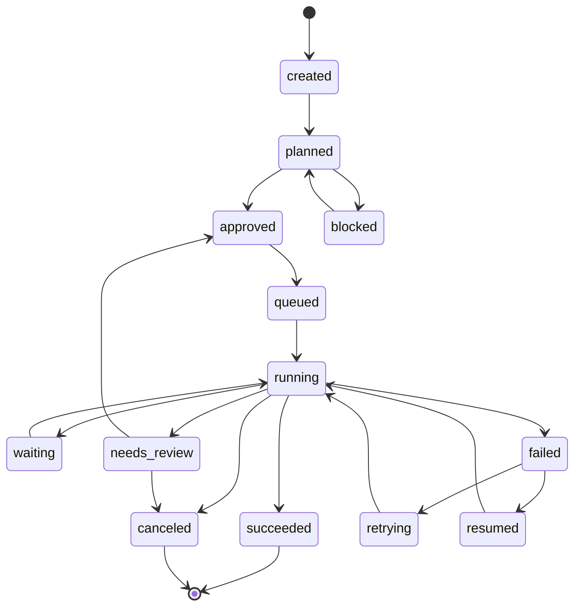
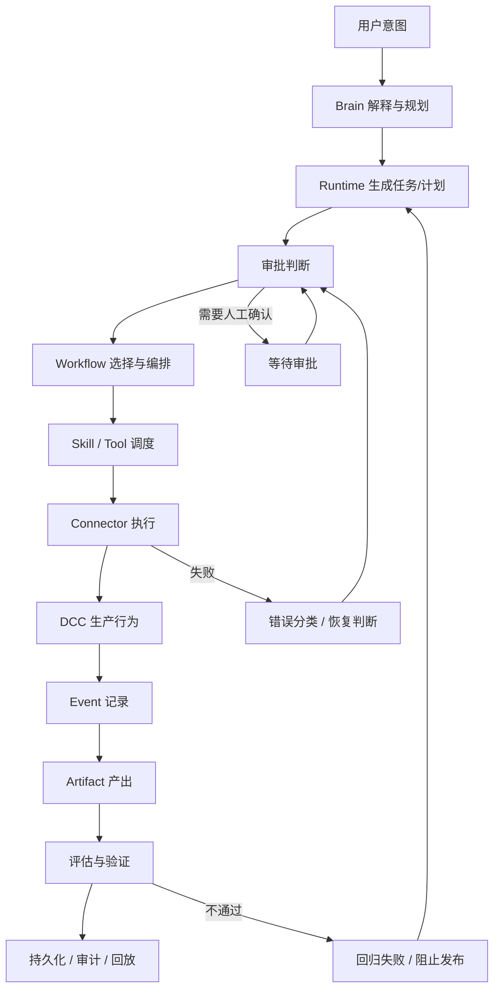

# 创意生产运行时
## 架构规范 v0.1

> 这是一个活文档，用于定义 AI 时代创意生产环境的统一 Runtime。
>
> 本文档的目标不是描述一个“能跑的 demo”，而是冻结系统语言、边界、契约、状态与治理方式。

---

## 0. 文档控制

- **状态**：草案
- **阶段**：Phase 0 到 Phase 1 Early
- **目标**：冻结第一层架构与术语
- **范围**：概念规范，不是实现文档
- **唯一来源**：本文档作为持续维护的主规范
- **规范级别**：
  - **MUST**：必须遵守
  - **SHOULD**：强烈建议
  - **MAY**：可选

### 0.1 修订记录

- `v0.1`：补充状态机、契约字段、权限治理、可观测性和版本原则
- `v0`：初始化架构骨架和核心定义

### 0.2 阅读顺序

1. 项目定位
2. 核心原则
3. 系统术语
4. 系统边界
5. 分层契约
6. Runtime Host
7. Runtime 状态机
8. Brain
9. Skill
10. Tool
11. Workflow
12. Event Model
13. Connector Model
14. Session 与 Context
15. 安全与权限
16. 版本与演进
17. 可观测性与日志
18. MVP 范围
19. 未决问题
20. 附录：当前已知架构
21. 附录：简要总结
22. 附录：架构图
23. 附录：P0 必补清单
24. 统一数据模型
25. 错误模型
26. 审批模型
27. 注册与发现机制
28. 评估与验证
29. 资产 / 工件模型
30. 状态归属矩阵
31. 控制面 / 执行面分离
32. 工作流边契约
33. 能力生命周期策略
34. 手递手 / 升级策略
35. 持久化边界
36. 测试与验证规范
37. 专业架构收口

---

## 1. 项目定位

### 1.1 这个项目是什么

本项目是一个面向 AI 时代创意生产环境的统一运行时。

它的目标是让 AI 以一种：

- 稳定
- 可扩展
- 可学习
- 可组合
- 可替换认知层

的方式进入真实的创意生产环境。

### 1.2 这个项目不是什么

本项目不是：

- 插件管理器
- AI 聊天产品
- 自动化脚本包装器
- 简单的 DCC Bridge
- 只面向单一 DCC 的窄工具

### 1.3 系统基本形态

```text
Brain
  ->
Runtime
  ->
Connector
  ->
DCC
```

### 1.4 核心命题

AI 是可替换的认知层。

Runtime 是长期稳定资产。

---

## 2. 核心原则

### 2.1 原则 1：Brain 可替换

Brain 可以随着时间变化。

例如：

- Hermes
- GPT
- Claude
- 未来模型

系统不能依赖某一个固定 Brain 的实现。

### 2.2 原则 2：Runtime 稳定

Runtime 是系统的耐久核心。

它必须在 Brain 变化时保持稳定。

### 2.3 原则 3：所有能力必须 Tool 化

生产能力应该以 Tool 或由 Tool 支撑的 Skill 来表达，而不是散落的临时代码。

### 2.4 原则 4：Skill 是真实资产

系统应该沉淀可复用的 Skill，而不是一次性的脚本片段。

### 2.5 原则 5：所有行为必须事件化

如果一个动作不能被观察成事件，它就无法被可靠地学习、追踪和改进。

### 2.6 原则 6：Workflow 是能力图

Workflow 是 Skill 之间的有向关系，不是简单的脚本链。

### 2.7 原则 7：Connector 是执行适配器

Connector 负责在目标 DCC 中“怎么做”。

它不负责“为什么做”。

### 2.8 原则 8：规范优先于实现

当规范和实现细节冲突时，应以规范为准，先修正契约，再修正实现。

---

## 3. 系统术语

### 3.1 Brain

Brain 是可替换的认知与决策层。

它负责：

- 识别意图
- 规划任务
- 选择工具
- 组合 Skill
- 理解上下文
- 给出建议

它不负责：

- 直接执行 DCC 操作
- 管理脚本执行细节
- 修改 Connector
- 持有长期 Runtime 状态

### 3.2 Runtime

Runtime 是系统的调度与编排层。

它负责：

- 分发请求
- 管理 Workflow 生命周期
- 管理 Connector
- 路由事件
- 执行 Skill
- 管理 Session
- 处理安全与权限

### 3.3 Runtime Host

Runtime Host 是承载 Runtime 的本地桌面应用。

它是系统在本地机器上的执行存在。

它负责：

- 维持本地可用性
- 绑定本地 Session
- 将 Runtime 请求转给 Connector
- 协调本地通信通道

### 3.4 Connector

Connector 是 DCC 的执行适配层。

它负责：

- DCC API 翻译
- 进程通信
- Session 绑定
- Tool 暴露
- 事件上报

### 3.5 Skill

Skill 是可描述、可复用、可组合的生产能力。

Skill 不是脚本本身。

Skill 是能力的系统级抽象。

### 3.6 Tool

Tool 是系统对外暴露的可调用单位。

Tool 是带有明确结构化契约的动作。

### 3.7 Workflow

Workflow 是由多个 Skill 组成的有向关系或编排路径。

### 3.8 Event

Event 是系统行为的可观察记录。

事件是学习、追踪、分析和可靠性的基础。

### 3.9 Session

Session 是用户、Runtime 和工具之间有边界的交互上下文。

### 3.10 Context

Context 是某一时刻可供 Brain 或 Runtime 使用的信息集合。

Context 可能包括：

- 当前任务
- 当前 Session
- 用户意图
- 已选资产
- Connector 状态
- 历史事件

### 3.11 术语速查

| 术语 | 一句话定义 | 核心职责 |
| --- | --- | --- |
| Brain | 可替换认知层 | 理解、规划、推荐 |
| Runtime | 调度编排层 | 分发、治理、执行 |
| Runtime Host | 本地承载层 | 承载本地 Runtime |
| Connector | DCC 执行适配层 | 翻译、通信、上报 |
| Skill | 可复用能力 | 表达生产能力 |
| Tool | 可调用契约 | 提供结构化动作 |
| Workflow | 能力组合图 | 编排多个 Skill |
| Event | 可观察行为记录 | 支持追踪与学习 |
| Session | 有界交互容器 | 绑定一次任务上下文 |
| Context | 决策所需信息 | 支持推理与执行 |

---

## 4. 系统边界

### 4.1 系统内部

系统内部包含：

- Brain 抽象
- Runtime 编排
- Runtime Host
- Skill
- Tool
- Workflow
- Event
- Connector
- Session 与 Context 管理
- 权限与可观测性

### 4.2 系统外部

系统不拥有：

- DCC 本体
- 模型提供方本体
- 整台用户机器
- 无关的桌面应用
- 不在 Runtime 契约内的任意脚本

### 4.3 边界规则

每一项能力都必须有明确边界：

- 哪一层拥有它
- 哪一层调用它
- 哪一层观察它
- 哪一层可以持久化它

---

## 5. 分层契约

### 5.1 契约结构

每一层都应定义：

- 定义
- 职责
- 不负责什么
- 输入
- 输出
- 状态归属
- 事件
- 依赖
- 约束
- 版本规则
- 示例

### 5.2 依赖方向

依赖必须沿着分层结构向下流动。

```text
Brain -> Runtime -> Connector -> DCC
```

高层可以理解低层。

低层不能依赖高层的智能。

### 5.3 契约规则

一份层契约必须清晰到足以满足：

- 不同团队实现
- 独立测试
- 不破坏整体架构的替换

### 5.4 规范级别要求

后续章节中，凡是影响执行、安全、状态、版本兼容性的规则，默认应写成 `MUST`。

凡是建议性的设计选择，应写成 `SHOULD`。

凡是可选项，应写成 `MAY`。

### 5.5 统一契约原则

所有可执行对象都应具有统一的外部契约风格。

至少应包括：

- 名称
- 版本
- 输入
- 输出
- 依赖
- 失败语义
- 可观测事件
- 兼容规则

---

## 6. Runtime Host

### 6.1 定义

Runtime Host 是承载 Runtime 的本地桌面应用。

### 6.2 它为什么存在

它提供本地稳定存在，用于：

- 本地执行
- 本地权限
- Session 绑定
- DCC 访问
- 设备级协调

### 6.3 它负责什么

Runtime Host 负责：

- 承载 Runtime 进程
- 维持本地生命周期
- 暴露 Runtime 入口
- 协调本地 Connector
- 保持 Web 层与本地执行层之间的边界

### 6.4 它不负责什么

Runtime Host 不负责：

- 高层创意决策
- 模型选择逻辑
- Skill 语义定义
- Connector 语义定义
- 替代 Runtime 本体

### 6.5 当前已知状态

当前已知状态：

- 它是一个桌面应用
- 它已经接通 Maya
- 底层实现细节在当前阶段暂时不作为架构前提

### 6.6 Runtime Host 的角色边界

Runtime Host 是本地执行载体，不是业务逻辑中心。

它 SHOULD：

- 提供本地可用性
- 保持会话存活
- 管理本地连接
- 上报执行状态

它 MUST NOT：

- 直接承载 Brain 决策
- 混入具体 DCC 业务逻辑
- 将临时代码当作长期协议

---

## 7. Runtime 状态机

### 7.1 为什么需要状态机

专业 agent 产品的核心不只是“会调用工具”，而是“能被稳定地驱动、暂停、恢复、回放和治理”。

如果没有状态机，就很难定义：

- 中断后怎么恢复
- 失败后是否重试
- 是否需要人工确认
- 哪一步算真正完成

### 7.2 标准状态

一个任务或工作流在 Runtime 中 SHOULD 至少具备以下状态：

- `created`
- `planned`
- `approved`
- `running`
- `waiting`
- `succeeded`
- `failed`
- `canceled`
- `resumed`

### 7.2.1 建议补充状态

在真实产品中，下面这些状态也常常需要：

- `queued`
- `blocked`
- `needs_review`
- `retrying`
- `partial_success`
- `rolled_back`

### 7.3 状态迁移规则

- `created -> planned`
- `planned -> approved`
- `approved -> running`
- `running -> waiting`
- `waiting -> running`
- `running -> succeeded`
- `running -> failed`
- `running -> canceled`
- `failed -> resumed`

状态迁移 SHOULD 由 Runtime 统一控制，Brain 不应直接修改运行状态。

### 7.3.1 状态迁移图



### 7.4 中断与恢复

Runtime MUST 能区分：

- 可恢复失败
- 不可恢复失败
- 人工介入等待

恢复动作 SHOULD 保留上下文和事件轨迹，避免“从头再来”式丢失。

### 7.5 人工介入点

当出现高风险操作、信息不足、权限不足或结果不确定时，Runtime SHOULD 暂停在人工介入点。

人工介入点是状态机的一部分，不是异常分支。

### 7.6 状态职责边界

- Brain 可以建议状态变化
- Runtime 决定并记录状态变化
- Connector 只上报执行结果，不直接改状态
- Event 负责把状态变化写成可追踪记录

### 7.7 状态最小要求

一个合格的 Runtime 状态机 MUST 至少满足：

- 状态是有限的
- 迁移是显式的
- 失败是可表示的
- 恢复是可定义的
- 人工介入是状态的一部分

### 7.8 Runtime API 的位置

Runtime API 是 Runtime 对外暴露的正式操作面。

它 SHOULD 服务于以下对象：

- Brain
- UI
- Connector 管理层
- 调试与观测工具

Runtime API 不应该直接暴露实现细节，而应该暴露稳定能力。

### 7.9 Runtime API 的原则

Runtime API MUST 满足：

- 结构化输入输出
- 明确错误语义
- 可观测
- 可版本化
- 不绕过状态机

### 7.10 Runtime API 能力范围

Runtime API SHOULD 至少覆盖以下能力：

- 会话创建与结束
- 任务提交与撤销
- 计划生成与确认
- 状态查询
- Tool 调度
- Skill 调度
- Workflow 执行
- Connector 绑定与解绑
- 事件查询
- 审计查询

### 7.11 Runtime API 示例能力表

```text
create_session
close_session
submit_task
cancel_task
approve_task
get_task_state
dispatch_tool
run_skill
start_workflow
bind_connector
unbind_connector
query_events
query_audit_log
```

### 7.12 Runtime API 约束

Runtime API SHOULD 具备以下约束：

- 所有写操作都应有明确副作用
- 所有破坏性操作都应可审计
- 所有长时操作都应返回可追踪标识
- 所有失败都应返回可分类错误

### 7.13 Runtime API 与状态机的关系

Runtime API 是状态机的入口和出口之一。

Runtime API 允许请求状态变化，但最终状态迁移 MUST 由 Runtime 判定与记录。

### 7.14 Runtime API 建议接口分组

为了保持接口结构清晰，Runtime API SHOULD 分为以下几组：

- Session API
- Task API
- Planning API
- Dispatch API
- Connector API
- Event API
- Audit API
- Health API

### 7.15 Runtime API 接口清单草案

#### 7.15.1 Session API

- `create_session`
- `close_session`
- `get_session`
- `list_sessions`

#### 7.15.2 Task API

- `submit_task`
- `cancel_task`
- `resume_task`
- `get_task_state`
- `approve_task`

#### 7.15.3 Planning API

- `plan_task`
- `revise_plan`
- `accept_plan`

#### 7.15.4 Dispatch API

- `dispatch_tool`
- `run_skill`
- `start_workflow`
- `stop_workflow`

#### 7.15.5 Connector API

- `bind_connector`
- `unbind_connector`
- `get_connector_state`
- `list_connectors`

#### 7.15.6 Event API

- `query_events`
- `subscribe_events`
- `get_trace`

#### 7.15.7 Audit API

- `query_audit_log`
- `get_action_history`

#### 7.15.8 Health API

- `get_runtime_health`
- `get_connector_health`
- `ping`

### 7.16 Runtime API 设计原则补充

所有 API SHOULD 尽量满足：

- 幂等性清晰
- 错误码稳定
- 请求可追踪
- 响应可序列化
- 返回结果可回放

### 7.17 Runtime API 接口级规范模板

每一个 Runtime API 接口 SHOULD 至少定义：

- 接口名
- 目的
- 输入参数
- 输出结果
- 失败语义
- 状态影响
- 权限要求
- 幂等性
- 是否需要确认
- 是否可订阅事件

### 7.18 Runtime API 示例接口

#### 7.18.1 `submit_task`

- 目的：提交一个待执行任务
- 输入：任务描述、目标能力、上下文、优先级
- 输出：task_id、初始状态、trace_id
- 失败语义：参数错误、权限不足、目标能力不可用
- 状态影响：创建或推进任务状态到 `planned`
- 权限要求：提交权限
- 幂等性：应提供去重标识

#### 7.18.2 `dispatch_tool`

- 目的：调度一个具体 Tool 执行
- 输入：tool_id、参数、session_id、trace_id
- 输出：execution_id、结果、事件引用
- 失败语义：schema 不匹配、权限不足、连接失败、执行失败
- 状态影响：推进相关任务或工作流状态
- 权限要求：工具执行权限
- 幂等性：SHOULD 支持重复请求识别

#### 7.18.3 `bind_connector`

- 目的：绑定一个 Connector 到当前 Runtime
- 输入：connector_id、连接参数、会话信息
- 输出：绑定结果、connector_state
- 失败语义：连接失败、身份校验失败、能力不兼容
- 状态影响：更新 connector 状态
- 权限要求：Connector 管理权限

### 7.19 Runtime API 设计建议

API 命名 SHOULD 保持动词明确、职责单一、返回可追踪标识。

API 不应该混合多个语义层级，例如：

- 一个接口同时做计划和执行
- 一个接口同时做查询和修改
- 一个接口同时负责状态变更和事件归档

这类设计会让 Runtime 失去可治理性。

---

## 8. Brain

### 8.1 定义

Brain 是可替换的认知与决策引擎。

### 8.2 职责

Brain 负责：

- 解释意图
- 规划 Tool Call
- 选择 Skill
- 组合 Workflow
- 推荐下一步动作

### 8.3 不负责什么

Brain 不负责：

- 直接执行 DCC
- 持有 Connector 状态
- 定义传输细节
- 修改 Runtime 内部实现

### 8.4 Brain 接口规则

Brain 应该通过结构化契约与系统交互，而不是直接接触实现细节。

### 8.5 Brain 输出约束

Brain 的输出 SHOULD 以结构化结果为主，而不是自由文本。

至少应尽量表达：

- 计划意图
- 目标 Tool 或 Skill
- 所需输入
- 风险提示
- 是否需要确认

Brain MUST NOT 绕过 Runtime 直接驱动 Connector。

---

## 9. Skill

### 9.1 定义

Skill 是带有清晰接口的可复用生产能力。

### 9.2 Skill 与 Script 的区别

- Script 是实现细节
- Skill 是能力抽象

### 9.3 Skill 的必需字段

一个 Skill 未来应当定义：

- id
- name
- intent
- inputs
- outputs
- connector target
- tool 映射
- metadata
- tags
- version
- execution definition

### 9.3.1 Skill Manifest 示例

```json
{
  "id": "maya.export_fbx.v1",
  "name": "导出 FBX",
  "intent": ["导出模型", "export fbx"],
  "inputs": {
    "selection": "mesh",
    "path": "string"
  },
  "outputs": {
    "fbx_file": "path"
  },
  "connector_target": "maya",
  "tool": "asset.export.fbx",
  "version": "1.0.0"
}
```

### 9.3.2 Skill 校验要求

一个 Skill 在进入 Runtime 前 SHOULD 通过校验：

- 标识是否唯一
- 输入输出是否完整
- connector target 是否存在
- tool 映射是否有效
- version 是否符合规范

没有通过校验的 Skill SHOULD 被视为未注册能力，而不是可运行能力。

### 9.4 Skill 规范建议字段

为了让 Skill 更适合专业 agent 产品，SHOULD 进一步补充：

- description
- owner
- category
- risk level
- permissions required
- retry policy
- idempotency hint
- compatibility notes
- observability tags

### 9.4.2 Skill 生命周期

Skill SHOULD 具备清晰生命周期：

- `draft`
- `registered`
- `validated`
- `deprecated`
- `retired`

Runtime SHOULD 只调度 `validated` 状态的 Skill，除非显式进入测试或开发模式。

### 9.4.1 Skill 设计补强建议

一个成熟的 Skill SHOULD 额外说明：

- 前置条件
- 后置条件
- 失败语义
- 幂等性
- 是否需要确认
- 可重试性
- 风险等级
- 权限需求

### 9.5 Skill 设计规则

Skill 必须可组合、可复用，并可跨 Workflow 使用。

### 9.6 Skill 沉淀规则

Skill 应被视为系统的持久资产，而不是一次性执行产物。

### 9.7 Skill 失败语义

Skill MUST 明确失败时的语义：

- 输入不合法
- 目标不可用
- 执行被拒绝
- DCC 返回失败
- 结果不确定

没有失败语义的 Skill 不应进入主规范。

### 9.8 Skill 与 Workflow 的关系

- Skill 是构件
- Workflow 是构件之间的关系
- Workflow 不能替代 Skill
- Skill 不能隐含 Workflow

---

## 10. Tool

### 10.1 定义

Tool 是 Runtime 和 Brain 使用的结构化可调用表面。

### 10.2 Tool 特征

Tool 应定义：

- 唯一名称
- 稳定 Schema
- 输入
- 输出
- 执行目标
- 错误行为

### 10.2.1 Tool Manifest 示例

```json
{
  "tool": "asset.export.fbx",
  "version": "1.0.0",
  "description": "Export selected mesh as FBX",
  "inputs": {
    "selection": "mesh",
    "path": "string"
  },
  "outputs": {
    "fbx_file": "path"
  },
  "permissions": ["filesystem.write"],
  "idempotent": false,
  "requires_confirmation": true
}
```

### 10.2.2 Tool 校验要求

Tool 在被调度前 SHOULD 至少校验：

- name 是否唯一
- schema 是否可解析
- 输入是否满足约束
- 输出是否可表达
- 权限是否足够
- 风险级别是否已知

### 10.2.3 Tool 生命周期

Tool SHOULD 也具备版本与生命周期管理：

- `draft`
- `available`
- `deprecated`
- `disabled`

Runtime SHOULD 避免直接依赖未标记为 `available` 的 Tool。

### 10.3 Tool 规则

Brain 应该围绕 Tool 进行推理，而不是围绕原始实现细节。

### 10.4 Tool 与 Skill 的关系

Tool 是可调用形式。

Skill 是可复用能力形式。

一个 Skill 可以映射到一个或多个 Tool。

### 10.5 Tool 约束

每个 Tool SHOULD 至少明确：

- 是否幂等
- 是否可重试
- 是否需要确认
- 是否可撤销
- 是否会修改外部状态

### 10.6 Tool 与 Skill 的关系边界

- Tool 是 Runtime 可直接调度的单元
- Skill 是面向能力复用的上层抽象
- 一个 Skill 可以绑定一个 Tool
- 一个复杂 Skill 也可以拆成多个 Tool
- 不能把 Tool 直接等同于脚本文件

这些信息对专业 agent 产品非常重要，因为它们直接决定调度器和审批器的行为。

---

## 11. Workflow

### 11.1 定义

Workflow 是由多个 Skill 构成的有向关系，用于描述一条生产路径。

### 11.2 Workflow 的形态

Workflow 可以是：

- 线性的
- 分支的
- 条件式的
- 可重试的
- 部分自动化的

### 11.2.1 Workflow 的最小结构

一个 Workflow SHOULD 至少包含：

- id
- name
- version
- entry point
- nodes
- edges
- terminal states
- retry policy
- approval points

### 11.2.2 Workflow 结构化表示

一个 Workflow SHOULD 至少能被表达为：

```json
{
  "id": "publish_asset_v1",
  "name": "发布资产",
  "version": "1.0.0",
  "entry_point": "start",
  "nodes": [],
  "edges": [],
  "terminal_states": ["succeeded", "failed", "canceled"],
  "retry_policy": {},
  "approval_points": []
}
```

### 11.2.3 Workflow 节点类型

Workflow 节点可以包括：

- skill node
- tool node
- decision node
- approval node
- wait node
- error node
- terminal node

### 11.2.4 Workflow 节点契约

每一个 Workflow 节点 SHOULD 至少定义：

- node_id
- node_type
- associated skill/tool
- input mapping
- output mapping
- preconditions
- postconditions
- failure behavior
- retry behavior
- approval requirement

### 11.3 Workflow 编排规则

Workflow SHOULD 被视为显式图结构，而不是隐式脚本顺序。

Workflow 节点应能够表达：

- 前置条件
- 后置条件
- 分支条件
- 重试条件
- 人工介入点

### 11.3.1 Workflow 状态建议

一个 Workflow SHOULD 至少支持以下运行状态：

- `idle`
- `running`
- `waiting`
- `blocked`
- `succeeded`
- `failed`
- `canceled`
- `paused`

### 11.3.2 Workflow 关系规则

Workflow 节点之间的边 SHOULD 明确表示：

- 顺序依赖
- 条件跳转
- 失败跳转
- 人工审批跳转
- 重试跳转

### 11.3.3 Workflow 校验输出

Workflow 校验 SHOULD 返回：

- 是否可运行
- 哪些节点缺失
- 哪些边不完整
- 哪些 Skill 不可用
- 哪些审批点未配置
- 哪些风险点未声明

### 11.4 Workflow 规则

Workflow 应依赖 Skill，而不是依赖某一个具体 DCC 的实现细节。

Workflow SHOULD 能够表达：

- 顺序执行
- 条件分支
- 人工确认
- 失败回退
- 局部重试

### 11.4.1 Workflow 校验要求

一个 Workflow 在进入 Runtime 前 SHOULD 至少校验：

- 节点是否完整
- 边是否闭合
- 起点是否明确
- 终点是否明确
- 所依赖的 Skill 是否存在
- 风险点是否已标记

### 11.4.2 Workflow 生命周期

Workflow SHOULD 具备清晰生命周期：

- `draft`
- `validated`
- `running`
- `paused`
- `completed`
- `failed`
- `retired`

### 11.5 Workflow 示例

```text
export_fbx
  ->
generate_lod
  ->
import_to_ue
  ->
publish_asset
```

---

## 12. Event Model

### 12.1 定义

Event 是某件事情在系统中发生过的可观察记录。

### 12.2 为什么需要 Event

没有 Event，系统就无法：

- 追踪
- 学习
- 推荐
- 诊断
- 改进

### 12.3 Event 的类别

Event 可包括：

- 生命周期事件
- Tool 执行事件
- Workflow 事件
- Connector 事件
- 错误事件
- 权限事件

### 12.3.1 Event 分类建议

Event SHOULD 进一步按系统层级分类：

- runtime.lifecycle
- session.lifecycle
- task.lifecycle
- planning.change
- workflow.transition
- skill.execution
- tool.execution
- connector.health
- audit.record
- permission.decision

### 12.4 Event 结构建议

为了支持专业级 trace、回放和诊断，Event SHOULD 至少包含：

- `event`
- `timestamp`
- `trace_id`
- `span_id`
- `source`
- `target`
- `status`
- `payload`
- `error`
- `duration`

### 12.4.2 Event 统一 Schema 建议

一个 Event SHOULD 支持以下统一字段族：

- identity: event, event_type, version
- timing: timestamp, duration
- trace: trace_id, span_id, parent_span_id
- source: source, actor, session_id
- target: target, workflow_id, skill_id, tool_id, connector_id
- outcome: status, error, result
- payload: payload, metadata

### 12.4.3 Event 分类层级

Event SHOULD 采用分层命名方式，例如：

- `runtime.lifecycle.created`
- `task.lifecycle.running`
- `workflow.transition.blocked`
- `skill.execution.succeeded`
- `tool.execution.failed`
- `connector.health.degraded`

### 12.4.1 Event 关联规则

每条 Event SHOULD 至少能够关联到以下对象中的一个或多个：

- session_id
- task_id
- workflow_id
- skill_id
- tool_id
- connector_id
- trace_id

### 12.5 Event 规则

每一个重要动作都应该产出 Event。

Event MUST 能被稳定关联到：

- Session
- Workflow
- Tool
- Skill
- Connector

没有关联关系的事件只能算日志片段，不能算系统级事件。

### 12.5.3 Event 语义规则

Event SHOULD 只描述“发生了什么”，不混入过多解释性推断。

如果需要推断原因，SHOULD 另写诊断事件或分析记录，而不是污染原始事件。

### 12.5.1 Event 生命周期建议

Event 本身 SHOULD 支持以下处理阶段：

- captured
- normalized
- stored
- indexed
- queried
- replayed

### 12.5.4 Event 查询原则

Event 查询 SHOULD 支持至少以下维度：

- 按 Session
- 按 Task
- 按 Workflow
- 按 Skill
- 按 Tool
- 按 Connector
- 按时间范围
- 按状态

### 12.5.2 Event 存储原则

Event SHOULD 保持 append-only 思维。

如果需要修正数据，优先采用补充事件，而不是直接覆盖历史事件。

### 12.6 Event 示例

```json
{
  "event": "skill.executed",
  "skill": "maya.export_fbx.v1",
  "status": "success",
  "duration": 1.8
}
```

---

## 13. Connector Model

### 13.1 定义

Connector 是 Runtime 与 DCC 之间的执行适配器。

### 13.2 职责

Connector 负责：

- 将 Runtime 意图翻译为 DCC 特定操作
- 管理进程通信
- 绑定 DCC Session
- 暴露可用能力
- 上报执行结果

### 13.2.1 Connector Manifest 建议

```json
{
  "id": "maya",
  "name": "Maya Connector",
  "version": "1.0.0",
  "capabilities": ["scene.open", "asset.export.fbx", "selection.query"],
  "transport": "tcp",
  "supports_events": true,
  "supports_reconnect": true
}
```

### 13.3 不负责什么

Connector 不负责：

- 定义 Workflow 逻辑
- 充当 AI 认知层
- 持有长期记忆
- 定义用户意图

### 13.3.1 Connector 能力边界

Connector SHOULD 明确它能做什么、不能做什么。

建议至少拆成三类能力：

- 查询类能力
- 修改类能力
- 破坏性能力

其中破坏性能力 SHOULD 默认需要更高权限或人工确认。

### 13.3.2 Connector 注册信息

Connector SHOULD 提供可注册信息，用于 Runtime 发现能力：

- id
- name
- version
- supported tools
- supported skills
- transport
- reconnect policy
- health status

### 13.3.3 Connector 启动要求

Connector 被 Runtime 接纳前 SHOULD 至少满足：

- 可连接
- 可识别
- 可查询能力
- 可上报状态
- 可返回错误语义

### 13.4 Connector 规则

Connector 回答的问题是：在这个 DCC 里“怎么做”。

它不回答：“为什么要做”。

### 13.4.1 Connector 生命周期

Connector SHOULD 具备清晰生命周期：

- `disconnected`
- `connecting`
- `connected`
- `degraded`
- `reconnecting`
- `disconnected`

Runtime SHOULD 观察并记录这个生命周期，而不是把连接失败看作临时异常文本。

### 13.4.2 Connector 健康状态

Connector SHOULD 公开健康状态，用于 Runtime 判定是否允许调度：

- healthy
- degraded
- unavailable
- reconnecting

健康状态与连接状态相关，但不完全等价。

### 13.5 Connector Contract 建议

专业产品中，Connector SHOULD 明确：

- 支持的能力列表
- 输入输出格式
- 连接生命周期
- 错误码
- 超时规则
- 重连规则
- 并发限制
- 资源占用边界

### 13.5.1 Connector 错误语义

Connector 返回的错误 SHOULD 至少可分为：

- 连接失败
- 权限失败
- 参数错误
- 执行失败
- 超时
- 结果不确定

这会直接影响 Runtime 是否应重试、等待、回滚或进入人工介入点。

### 13.5.2 Connector 与 Skill 的绑定

Connector SHOULD 不直接暴露“业务结果”，而应暴露其支持的能力集合。

Skill 再基于 Connector 能力集合形成可复用能力。

### 13.6 Maya 作为第一个参考 Connector

Maya 是当前第一个已确认接通的 Connector 目标。

Maya Connector 应作为首个参考模型来定义契约。

---

## 14. Session 与 Context

### 14.1 Session

Session 是一个有边界的交互容器。

它应该包含：

- 当前用户请求
- 活跃 Runtime 状态
- 相关 Tool
- 当前 Connector 绑定

### 14.2 Context

Context 是用于推理和执行的信息集合。

Context 可能包括：

- Session 状态
- 最近事件
- 已选资产
- Tool 可用性
- Connector 状态
- 用户约束

### 14.3 状态规则

状态应被明确分类为：

- 瞬时状态
- Session 级状态
- 持久状态
- 可恢复状态

### 14.4 Context 边界

Context SHOULD 只承载当前决策和执行所需的信息。

Context 不应成为无界的“全量记忆桶”。

如果上下文过大，应拆分为：

- 当前上下文
- 历史上下文
- 持久上下文
- 检索上下文

---

## 15. 安全与权限

### 15.1 权限原则

所有执行都必须遵守显式权限和作用域。

### 15.2 访问边界

Runtime 必须定义：

- 什么可以执行
- 在哪里执行
- 由哪个 Connector 执行
- 可以访问哪些资源

### 15.3 权限分层建议

专业 agent 产品通常至少会区分：

- 用户级权限
- 项目级权限
- Session 级权限
- Connector 级权限
- 高风险操作权限

### 15.4 高风险操作

下列能力 SHOULD 默认进入高风险范围：

- 覆盖性写入
- 批量删除
- 资产发布
- 文件系统关键路径访问
- 无确认的外部执行

高风险操作 SHOULD 具备确认、审计和回滚策略。

### 15.5 安全规则

任何一层都不应该无声地扩张自己的职责边界。

---

## 16. 版本与演进

### 16.1 Brain 演进

Brain 可以被替换，而不需要重构 Runtime 核心。

### 16.2 Skill 版本化

Skill 必须支持显式版本。

### 16.3 版本兼容原则

版本演进 SHOULD 明确三种兼容性：

- 向后兼容
- 向前兼容
- 不兼容变更

不兼容变更 MUST 在文档中显式标注。

### 16.4 Tool 兼容性

Tool Schema 的演进应该尽量考虑向后兼容。

### 16.5 Connector 演进

Connector 可以随着新的 DCC 能力而扩展。

### 16.6 Runtime 稳定性规则

Runtime 必须在模型和 Connector 演进中保持稳定。

---

## 17. 可观测性与日志

### 17.1 可观测性目标

系统应该能够回答：

- 发生了什么
- 什么时候发生的
- 是哪一层做的
- 为什么失败
- 结果是什么

### 17.2 可观测性表面

可观测性模型应包含：

- 日志
- 事件
- 执行轨迹
- 失败原因
- 成功状态

### 17.3 Trace 规则

专业 agent 产品 SHOULD 支持按以下维度回放一次执行：

- Session
- Workflow
- Tool
- Skill
- Connector
- 时间线

### 17.4 观测指标建议

可观测性不仅要记录“有没有成功”，还应记录：

- latency
- retry count
- error rate
- approval wait time
- connector availability
- recovery success rate

### 17.5 学习规则

被观察到的事件是未来 Workflow Memory 和推荐系统的原始材料。

---

## 18. MVP 范围

### 18.1 当前目标

当前目标不是完整自治。

当前目标是冻结第一层系统语言。

### 18.2 第一版规范必须包含什么

第一版规范必须定义：

- 术语
- 分层边界
- 契约
- 事件模型
- Runtime Host 角色
- Connector 角色
- Skill 角色

### 18.3 可以暂缓的内容

以下内容可以暂缓：

- 自主 Agent 行为
- 长期记忆系统
- 多 Agent 协作
- 自修改 Connector
- 高级学习优化

### 18.4 当前最应优先冻结的三件事

如果以专业团队视角排序，当前最优先冻结的是：

1. Runtime 状态机
2. Tool / Skill / Connector 契约
3. Event 与 Trace 结构

---

## 19. 未决问题

本节应该随着架构演进持续维护。

### 19.1 未解决项

- Tool Schema 的精确形态
- Skill Schema 的精确形态
- Event Schema 的精确形态
- Runtime API 的精确形态
- Connector Contract 的精确形态
- Session 持久化规则
- 权限模型

### 19.2 未来决策

- Workflow 应该以图、链，还是两者兼具的方式表达
- Runtime 状态是否完全本地化
- 是否所有 Connector 共享统一基类契约
- Brain 提供方如何在运行时切换

### 19.3 建议新增的未决项

- 人工介入点如何定义
- 审批如何挂接到状态机
- 失败是否默认可重试
- 会话是否支持恢复到上次检查点
- Tool 的幂等性如何声明
- 高风险操作是否需要双重确认

---

## 20. 附录：当前已知架构

```text
Web
  ->
本地桌面应用
  ->
Runtime
  ->
Maya Connector
  ->
Maya
```

这是当前已知的基础形态。

---

## 21. 附录：简要总结

本系统被定义为一个创意生产运行时。

它的核心思想是：

- Brain 可替换
- Runtime 稳定
- Connector 是适配器
- Skill 是可复用资产
- Workflow 是能力图
- Event 是学习基底

---

## 22. 附录：架构图

### 22.1 总体架构树

```mermaid
flowchart TD
  A["Creative Production Runtime<br/>[D0] 架构规范 v0.1"]

  A --> B["项目定位<br/>[D1]"]
  A --> C["核心原则<br/>[D1]"]
  A --> D["系统术语<br/>[D1]"]
  A --> E["系统边界<br/>[D1]"]
  A --> F["分层契约<br/>[D1]"]

  A --> G["Runtime Host<br/>[D1]"]
  A --> H["Runtime 状态机<br/>[D1]"]
  H --> H1["状态集合<br/>[D2]"]
  H --> H2["状态迁移<br/>[D2]"]
  H --> H3["中断与恢复<br/>[D2]"]
  H --> H4["人工介入点<br/>[D2]"]
  H --> H5["Runtime API<br/>[D2]"]

  H5 --> H51["Session API<br/>[D3]"]
  H5 --> H52["Task API<br/>[D3]"]
  H5 --> H53["Planning API<br/>[D3]"]
  H5 --> H54["Dispatch API<br/>[D3]"]
  H5 --> H55["Connector API<br/>[D3]"]
  H5 --> H56["Event API<br/>[D3]"]
  H5 --> H57["Audit API<br/>[D3]"]
  H5 --> H58["Health API<br/>[D3]"]

  A --> I["Brain<br/>[D1]"]
  I --> I1["意图理解<br/>[D2]"]
  I --> I2["规划<br/>[D2]"]
  I --> I3["Tool Call<br/>[D2]"]
  I --> I4["Skill 选择<br/>[D2]"]
  I --> I5["Workflow 组合<br/>[D2]"]

  A --> J["Skill<br/>[D1]"]
  J --> J1["定义 / Manifest / 校验<br/>[D2]"]
  J --> J2["生命周期 / 失败语义<br/>[D2]"]
  J --> J3["Workflow 关系<br/>[D2]"]

  A --> K["Tool<br/>[D1]"]
  K --> K1["定义 / Manifest / 校验<br/>[D2]"]
  K --> K2["生命周期 / 幂等 / 确认<br/>[D2]"]
  K --> K3["Skill 边界<br/>[D2]"]

  A --> L["Workflow<br/>[D1]"]
  L --> L1["最小结构<br/>[D2]"]
  L --> L2["节点类型 / 节点契约<br/>[D2]"]
  L --> L3["运行状态 / 校验 / 生命周期<br/>[D2]"]

  A --> M["Event Model<br/>[D1]"]
  M --> M1["分类 / 结构 / Schema<br/>[D2]"]
  M --> M2["关联规则 / 生命周期 / 查询<br/>[D2]"]
  M --> M3["append-only 约束<br/>[D2]"]

  A --> N["Connector Model<br/>[D1]"]
  N --> N1["Manifest / 能力边界<br/>[D2]"]
  N --> N2["生命周期 / 健康状态<br/>[D2]"]
  N --> N3["错误语义 / 与 Skill/Tool 关系<br/>[D2]"]

  A --> O["Session 与 Context<br/>[D1]"]
  O --> O1["Session / Context 定义<br/>[D2]"]
  O --> O2["状态分类 / 边界<br/>[D2]"]

  A --> P["安全与权限<br/>[D1]"]
  P --> P1["权限分层 / 高风险操作<br/>[D2]"]
  P --> P2["审计与回滚<br/>[D2]"]

  A --> Q["版本与演进<br/>[D1]"]
  Q --> Q1["Brain / Skill / Tool / Connector<br/>[D2]"]
  Q --> Q2["Runtime 稳定性<br/>[D2]"]

  A --> R["可观测性与日志<br/>[D1]"]
  R --> R1["Trace / 指标<br/>[D2]"]
  R --> R2["回放 / 学习数据<br/>[D2]"]

  A --> S["MVP 范围<br/>[D1]"]
  S --> S1["当前目标 / 必含 / 可暂缓<br/>[D2]"]
  S --> S2["优先冻结项<br/>[D2]"]

  A --> T["未决问题<br/>[D1]"]
  T --> T1["待定 Schema / API / 规则<br/>[D2]"]

  A --> U["评估与验证<br/>[D1]"]
  U --> U1["基准用例 / 回归验证<br/>[D2]"]
  U --> U2["成功率 / 稳定性 / 一致性<br/>[D2]"]

  A --> V["资产 / 工件模型<br/>[D1]"]
  V --> V1["资产字段 / 生命周期<br/>[D2]"]
  V --> V2["来源追溯 / 版本 / 存储边界<br/>[D2]"]

  A --> W["状态归属矩阵<br/>[D1]"]
  W --> W1["对象 / 拥有者 / 变更入口<br/>[D2]"]

  A --> X["控制面 / 执行面分离<br/>[D1]"]
  X --> X1["控制面：策略 / 审批 / 调度<br/>[D2]"]
  X --> X2["执行面：Tool / Skill / Connector<br/>[D2]"]

  A --> Y["工作流边契约<br/>[D1]"]
  Y --> Y1["边类型 / 跳转条件 / 失败路径<br/>[D2]"]

  A --> Z["能力生命周期策略<br/>[D1]"]
  Z --> Z1["draft -> validated -> available<br/>[D2]"]
  Z --> Z2["deprecated / disabled / retired<br/>[D2]"]

  A --> AA["手递手 / 升级策略<br/>[D1]"]
  AA --> AA1["handoff / escalation / audit<br/>[D2]"]

  A --> AB["持久化边界<br/>[D1]"]
  AB --> AB1["Session / Task / Artifact 持久化<br/>[D2]"]
  AB --> AB2["Event / Audit / Replay 边界<br/>[D2]"]

  A --> AC["测试与验证规范<br/>[D1]"]
  AC --> AC1["契约测试 / 回归 / 沙箱<br/>[D2]"]
  AC --> AC2["基准用例 / 红线测试<br/>[D2]"]

  A --> AD["专业架构收口<br/>[D1]"]
  AD --> AD1["端到端执行生命周期<br/>[D2]"]
  AD --> AD2["架构冻结标准 / 基线条件<br/>[D2]"]
```



### 22.2 分支深度观察

- 最深分支：`Runtime -> Runtime API -> 各类 API`，当前深度约为 `D3`
- 次深分支：`Skill / Tool / Workflow / Event / Connector`，当前深度约为 `D2`
- 中层分支：`Runtime Host / Brain / Session 与 Context / 安全与权限 / 版本与演进 / 可观测性 / 资产 / 工件模型`，当前深度约为 `D1~D2`
- 治理分支：`安全与权限 / 错误模型 / 审批模型 / 注册与发现机制 / 状态归属矩阵 / 控制面 / 执行面分离 / 能力生命周期策略 / 手递手策略 / 持久化边界 / 测试与验证规范 / 专业架构收口`，目前更偏向“横向治理层”，后续会继续加深

### 22.3 深度维护规则

- 每次新增章节时，应同步判断它属于哪一条分支
- 如果新增内容让某个分支加深到新的层级，应更新此图和分支深度说明
- 如果新增的是治理横切层，应标注为“横向扩展”，避免误判为主干加深

---

## 23. 附录：P0 必补清单

### 23.1 主根

1. 统一数据模型
2. 错误模型
3. 审批模型
4. 评估与验证
5. 资产 / 工件模型
6. 执行生命周期总图

### 23.2 关键根系

1. 注册与发现机制
2. 权限与作用域模型
3. 持久化边界
4. 状态归属矩阵
5. 版本兼容策略
6. 控制面 / 执行面分离

### 23.3 增强根系

1. 工作流编排模型
2. 事件订阅与通知
3. 测试与验证规范
4. 工作流边契约
5. 能力生命周期策略
6. 手递手 / 升级策略

### 23.4 当前优先级建议

- **P0**：先补主根
- **P1**：再补关键根系
- **P2**：最后补增强根系

---

## 24. 统一数据模型

### 24.1 为什么需要统一数据模型

当前文档已经有很多对象：

- Session
- Task
- Skill
- Tool
- Workflow
- Event
- Connector
- Runtime API 请求与响应

如果没有统一数据模型，这些对象会逐渐各说各话，后续会很难做：

- 版本兼容
- 事件追踪
- 权限治理
- 回放
- 审计
- 注册发现

### 24.2 统一数据模型原则

统一数据模型 SHOULD 满足：

- 有最小公共字段
- 能表达版本
- 能表达状态
- 能表达来源与归属
- 能表达权限与风险
- 能表达时间与追踪

### 24.3 基础公共字段

以下字段 SHOULD 尽量出现在所有核心对象上：

- `id`
- `name`
- `version`
- `status`
- `type`
- `owner`
- `created_at`
- `updated_at`
- `trace_id`
- `source`
- `metadata`

### 24.4 通用对象骨架

```json
{
  "id": "string",
  "name": "string",
  "version": "string",
  "status": "string",
  "type": "string",
  "owner": "string",
  "created_at": "string",
  "updated_at": "string",
  "trace_id": "string",
  "source": "string",
  "metadata": {}
}
```

### 24.5 统一状态模型

核心对象 SHOULD 至少能表达以下状态维度之一：

- `draft`
- `registered`
- `validated`
- `available`
- `running`
- `waiting`
- `failed`
- `disabled`
- `deprecated`
- `retired`

不同对象可以使用自己的状态集合，但 SHOULD 能映射到这些公共状态语义。

### 24.6 统一错误模型

所有可执行对象 SHOULD 能返回统一错误结构，至少包含：

- `error_code`
- `error_type`
- `message`
- `recoverable`
- `retryable`
- `source`
- `trace_id`

### 24.7 统一权限模型

所有可执行对象 SHOULD 声明权限需求：

- `permissions_required`
- `risk_level`
- `requires_confirmation`
- `scope`

### 24.8 统一追踪模型

所有对象在产生行为时 SHOULD 能挂接：

- `trace_id`
- `span_id`
- `parent_span_id`

这样可以让一次执行从 Brain 到 Runtime 到 Connector 再到 DCC 完整串起来。

### 24.9 对象映射关系

| 对象 | 主要字段重点 |
| --- | --- |
| Session | task, scope, lifecycle, trace |
| Task | goal, state, approval, execution |
| Skill | intent, inputs, outputs, connector_target |
| Tool | schema, permissions, idempotency |
| Workflow | nodes, edges, state, retry |
| Event | trace, source, target, status |
| Connector | capabilities, health, transport |
| Runtime API | operation, input, output, error |

---

## 25. 错误模型

### 25.1 为什么需要统一错误模型

如果不同层用不同方式表达错误，Runtime 就很难决定：

- 是否重试
- 是否回滚
- 是否等待人工确认
- 是否标记为不可恢复
- 是否进入审计

统一错误模型是专业 agent 产品治理能力的核心之一。

### 25.2 错误分类

系统 SHOULD 至少区分以下错误类型：

- `validation_error`
- `permission_error`
- `availability_error`
- `transport_error`
- `execution_error`
- `timeout_error`
- `conflict_error`
- `unknown_error`
- `incomplete_result`

### 25.3 错误恢复语义

所有错误 SHOULD 能标注：

- 是否可恢复
- 是否可重试
- 是否需要人工介入
- 是否需要回滚
- 是否需要审计保留

### 25.4 统一错误结构

```json
{
  "error_code": "string",
  "error_type": "string",
  "message": "string",
  "recoverable": true,
  "retryable": false,
  "requires_human_review": false,
  "source": "string",
  "trace_id": "string",
  "details": {}
}
```

### 25.5 错误处理规则

- 参数错误 SHOULD 立即失败，不应盲目重试
- 权限错误 SHOULD 进入审批或拒绝流程
- 连接错误 SHOULD 优先考虑重连
- 执行错误 SHOULD 结合上下文判断是否回滚
- 结果不确定 SHOULD 默认进入人工介入点

### 25.6 错误传播原则

错误在层间传播时 SHOULD 保留原始语义。

Runtime 可以包装错误，但不应抹掉：

- 原始错误码
- 原始来源
- trace 信息
- 恢复建议

---

## 26. 审批模型

### 26.1 为什么需要审批模型

专业 agent 产品不能只依赖“模型自己判断要不要做”。

当涉及：

- 高风险操作
- 破坏性修改
- 资产发布
- 文件系统写入
- 外部执行

时，系统 SHOULD 允许人工介入审批。

### 26.2 审批触发条件

审批 SHOULD 至少在以下场景触发：

- 高风险 Tool 调用
- 破坏性 Connector 操作
- 权限不足但可申请时
- 结果不确定需要确认时
- Workflow 到达人工控制点时

### 26.3 审批状态

审批流程 SHOULD 至少包含：

- `not_required`
- `pending`
- `approved`
- `rejected`
- `expired`
- `canceled`

### 26.4 审批对象

审批 SHOULD 可以绑定到：

- Task
- Workflow
- Tool
- Skill
- Connector 操作

### 26.5 审批记录

每次审批 SHOULD 记录：

- 审批对象
- 审批人
- 审批时间
- 审批理由
- 审批结果
- 关联 trace_id

### 26.6 审批规则

- 无审批通过，不应执行需要审批的操作
- 审批过期应视为无效
- 审批应可审计、可追踪、可回放
- 审批不应被 Brain 绕过

### 26.7 审批与状态机关系

审批是状态机的一部分，不是状态机外的附属流程。

Workflow 或 Task 在等待人工确认时，应显式进入 `waiting` 或 `needs_review` 类状态。

---

## 27. 注册与发现机制

### 27.1 为什么需要注册与发现

如果系统中的能力不能被发现，就不能形成真正的 Runtime。

注册与发现机制决定系统能否做到：

- 动态加载能力
- 禁用/退役能力
- 查询可用工具
- 自动生成能力索引
- 在运行时切换能力提供者

### 27.2 注册对象

以下对象 SHOULD 支持注册：

- Skill
- Tool
- Connector
- Workflow

### 27.3 注册信息

注册信息 SHOULD 至少包含：

- id
- name
- version
- status
- owner
- capabilities
- dependencies
- permissions
- risk_level
- lifecycle

### 27.4 发现机制

Runtime SHOULD 支持以下发现方式：

- 静态注册
- 动态加载
- 查询索引
- 按标签筛选
- 按能力关键词搜索

### 27.5 注册生命周期

注册对象 SHOULD 至少经历：

- `draft`
- `registered`
- `validated`
- `available`
- `deprecated`
- `retired`

### 27.6 注册与禁用

注册不等于可运行。

一个对象即使已注册，也可能因为以下原因不可用：

- 校验失败
- 权限不足
- 依赖缺失
- 连接异常
- 被手动禁用

### 27.7 发现接口建议

Runtime SHOULD 提供以下发现能力：

- `list_skills`
- `list_tools`
- `list_connectors`
- `search_capabilities`
- `get_manifest`

### 27.8 发现结果要求

发现结果 SHOULD 能回答：

- 能做什么
- 由谁提供
- 当前是否可用
- 需要什么权限
- 风险等级是什么
- 依赖是否完整

### 27.9 与版本的关系

发现机制 MUST 兼容版本化。

同一个能力如果有多个版本，Runtime SHOULD 明确：

- 默认版本
- 可用版本
- 退役版本
- 兼容版本

---

## 28. 评估与验证

### 28.1 为什么需要评估体系

专业 agent 产品不能只看“能不能跑”，还要看：

- 是否稳定
- 是否可重复
- 是否符合预期
- 是否可回归
- 是否真的提升生产效率

没有评估体系，就无法判断 Runtime、Skill、Workflow 是否真的成熟。

### 28.2 评估对象

评估 SHOULD 覆盖：

- Skill
- Tool
- Workflow
- Connector
- Runtime API
- Brain 输出质量

### 28.3 评估维度

评估 SHOULD 至少包含：

- 成功率
- 失败率
- 重试率
- 人工介入率
- 平均执行时长
- 结果一致性
- 回放一致性
- 审批命中率

### 28.4 基准用例

系统 SHOULD 维护一组基准用例：

- 正常路径
- 参数错误
- 权限不足
- 连接失败
- 超时
- 结果不确定
- 人工审批
- 回滚路径

### 28.5 回归验证

每次 Skill、Tool、Connector、Runtime API 变更后，SHOULD 运行回归验证。

回归验证 SHOULD 至少检查：

- 契约是否破坏
- 状态是否异常
- 事件是否齐全
- 错误是否分类正确
- 审批是否触发正确

### 28.6 评估结果

评估结果 SHOULD 以可追踪记录保存，并可挂接到：

- 版本
- 负责人
- 运行环境
- 关联事件
- 关联工件

---

## 29. 资产 / 工件模型

### 29.1 为什么需要资产模型

创意生产的结果不是抽象状态，而是实际工件：

- 场景文件
- 贴图
- 模型
- 动画
- 导出包
- 中间缓存
- 发布资产

如果没有资产模型，系统就只能知道“做过什么”，不知道“产出了什么”。

### 29.2 工件定义

Artifact / Asset 是系统生产和管理的结果对象。

### 29.3 资产应包含的字段

- id
- name
- type
- version
- source
- generated_by
- parent_trace_id
- storage_uri
- status
- mutability
- approval_status

### 29.4 资产生命周期

资产 SHOULD 至少具备：

- `created`
- `derived`
- `validated`
- `approved`
- `published`
- `deprecated`
- `archived`

### 29.5 资产与事件关系

每个资产 SHOULD 能追溯到：

- 由哪个 Skill 或 Tool 生成
- 属于哪个 Workflow
- 关联哪些 Event
- 经过哪些审批

### 29.6 资产边界

资产不是临时变量。

资产 SHOULD 具备清晰存储边界、版本边界和可追溯边界。

---

## 30. 状态归属矩阵

### 30.1 为什么需要状态归属矩阵

现在文档里多个对象都定义了状态，但还缺一张总表说明：

- 谁拥有状态
- 谁可以改状态
- 谁只能读状态
- 谁负责恢复

### 30.2 状态归属原则

- Brain 可以建议状态
- Runtime 决定状态
- Connector 上报状态
- Event 记录状态
- UI 读取状态

### 30.3 状态归属矩阵

| 对象 | 状态拥有者 | 状态变更入口 | 可恢复 | 可审计 |
| --- | --- | --- | --- | --- |
| Session | Runtime | Runtime API | 是 | 是 |
| Task | Runtime | Runtime API / Workflow | 是 | 是 |
| Workflow | Runtime | Runtime API | 是 | 是 |
| Skill | Registry / Runtime | 注册与发布流程 | 是 | 是 |
| Tool | Registry / Runtime | 注册与发布流程 | 是 | 是 |
| Connector | Runtime | Connector 生命周期 | 是 | 是 |
| Event | Runtime | 事件管线 | 否 | 是 |
| Artifact | Runtime / Storage | Workflow / Tool 输出 | 是 | 是 |

### 30.4 状态变更规则

状态变更 SHOULD 只通过统一入口发生。

禁止绕过统一入口直接改内部状态。

---

## 31. 控制面 / 执行面分离

### 31.1 为什么要分离

如果控制面和执行面不分离，Runtime 容易膨胀成一个难以维护的巨型中枢。

### 31.2 控制面

控制面 SHOULD 负责：

- 状态机
- 策略
- 审批
- 注册发现
- 权限
- 调度决策
- 审计

### 31.3 执行面

执行面 SHOULD 负责：

- Tool 执行
- Skill 执行
- Connector 通信
- DCC 操作
- 结果回传

### 31.4 分离原则

- 控制面 SHOULD 尽量无副作用
- 执行面 SHOULD 尽量少做决策
- 控制面决定“做不做”
- 执行面负责“怎么做”

---

## 32. 工作流边契约

### 32.1 为什么需要边契约

仅有节点不够，工作流的真实行为往往发生在节点之间的“边”上。

### 32.2 边应包含的语义

每条边 SHOULD 至少表达：

- 从哪个节点到哪个节点
- 跳转条件
- 触发事件
- 失败路径
- 审批路径
- 重试路径

### 32.3 边类型

边 SHOULD 支持：

- 顺序边
- 条件边
- 失败边
- 审批边
- 重试边
- 子工作流边

### 32.4 边校验

Workflow 校验 SHOULD 检查：

- 边是否闭合
- 条件是否完备
- 是否存在悬空节点
- 是否存在无法抵达终点的路径

---

## 33. 能力生命周期策略

### 33.1 为什么需要能力生命周期策略

Skill、Tool、Connector 都在不断演进，如果没有统一生命周期，系统会失控。

### 33.2 生命周期阶段

能力对象 SHOULD 统一支持：

- `draft`
- `registered`
- `validated`
- `available`
- `deprecated`
- `disabled`
- `retired`

### 33.3 生命周期规则

- `draft` 不应进入生产执行
- `validated` 才能进入可运行状态
- `deprecated` 可以继续存在，但 SHOULD 提示替代项
- `disabled` 不应被调度
- `retired` 不应被默认发现

### 33.4 默认选择策略

如果同一能力存在多个版本，Runtime SHOULD 明确：

- 默认版本
- 指定版本
- 兼容版本
- 退役版本

### 33.5 退役规则

退役能力 SHOULD 保留：

- 历史追踪
- 回放能力
- 审计可见性

但不应再作为默认执行目标。

---

## 34. 手递手 / 升级策略

### 34.1 为什么需要 handoff

专业 agent 产品通常不是单一角色一路做完，而是在不同层之间有明确的 handoff。

### 34.2 handoff 触发

handoff SHOULD 在以下场景触发：

- Brain 需要把执行交给 Runtime
- Runtime 需要把具体执行交给 Connector
- 自动执行遇到人工审批
- 某一步失败需要升级处理

### 34.3 升级策略

当系统无法安全决策时，应升级到：

- 人工确认
- 更高权限主体
- 更保守的执行模式

### 34.4 handoff 记录

每次 handoff SHOULD 记录：

- from
- to
- reason
- trace_id
- status

### 34.5 handoff 原则

- handoff 不应丢失上下文
- handoff 不应隐藏责任归属
- handoff 不应绕过审计

---

## 35. 持久化边界

### 35.1 为什么需要持久化边界

如果不明确哪些状态需要持久化，系统后面会出现：

- 记忆过度膨胀
- 会话恢复不一致
- 审计缺失
- 事件和状态混杂
- 临时态被错误当成永久态

### 35.2 持久化分类

系统 SHOULD 至少区分：

- 瞬时数据
- Session 数据
- 可恢复数据
- 长期资产数据
- 审计数据
- 回放数据

### 35.3 应持久化的对象

以下对象 SHOULD 默认支持持久化：

- Session
- Task
- Workflow
- Skill registry entry
- Tool registry entry
- Connector registry entry
- Event
- Audit record
- Artifact / Asset

### 35.4 不应默认持久化的对象

以下内容 SHOULD 默认视为运行时瞬时数据：

- Brain 的临时推理中间态
- 一次性的上下文缓存
- 临时的调度草稿
- 未确认的草稿输出
- 局部重试中的临时变量

### 35.5 持久化层级

持久化 SHOULD 至少分为：

- 内存级
- Session 级
- 项目级
- 资产级
- 审计级

### 35.6 持久化规则

- 该落盘的数据 MUST 落盘
- 该可回放的数据 SHOULD 保留足够上下文
- 该仅瞬时存在的数据 MUST NOT 被误写入长期存储
- 任何持久化对象都应有归属、版本和 trace 信息

### 35.7 恢复规则

可恢复数据 SHOULD 能支撑：

- Session 恢复
- Task 恢复
- Workflow 恢复
- Connector 重连
- 失败后恢复执行

### 35.8 存储边界原则

Runtime SHOULD 明确哪些内容属于：

- 业务状态
- 运行状态
- 审计状态
- 分析状态
- 缓存状态

这些状态不应混写。

---

## 36. 测试与验证规范

### 36.1 为什么需要测试与验证

专业 agent 产品的架构不是“写完就算”，而是必须可以持续验证：

- 契约是否没坏
- 状态是否没乱
- 错误是否被正确分类
- 审批是否按预期触发
- 事件是否完整
- 回放是否一致

### 36.2 测试层级

系统 SHOULD 至少包含：

- 单元测试
- 契约测试
- 集成测试
- 回归测试
- 回放测试
- 沙箱测试

### 36.3 验证对象

测试与验证 SHOULD 覆盖：

- Runtime API
- Skill
- Tool
- Workflow
- Connector
- Event pipeline
- Approval policy
- Error model

### 36.4 基准用例

系统 SHOULD 维护基准用例集，包括：

- 正常执行
- 参数错误
- 权限不足
- 连接失败
- 超时
- 结果不确定
- 人工审批
- 回滚

### 36.5 契约测试

契约测试 SHOULD 验证：

- API 输入输出是否符合规范
- Manifest 是否符合 schema
- 错误码是否稳定
- 状态变化是否符合约定

### 36.6 回归测试

每次改动 Skill、Tool、Connector、Workflow、Runtime API 后，SHOULD 运行回归测试。

回归测试 SHOULD 检查：

- 是否破坏已有能力
- 是否引入新的失败路径
- 是否影响事件结构
- 是否影响审批和状态机

### 36.7 沙箱测试

高风险操作 SHOULD 先在沙箱或模拟环境验证，再进入真实执行面。

### 36.8 回放测试

系统 SHOULD 能拿历史事件轨迹进行回放验证，检查：

- 执行路径是否一致
- 状态迁移是否一致
- 错误分类是否一致
- 审批行为是否一致

### 36.9 验证结果

验证结果 SHOULD 可追踪，并应关联：

- 版本
- 测试环境
- 用例编号
- 失败原因
- 负责人

### 36.10 验证原则

- 没有验证通过的能力不应默认进入生产可用状态
- 验证失败应阻止不安全变更上线
- 验证结果应反哺评估体系和能力生命周期

---

## 37. 专业架构收口

### 37.1 为什么需要收口

当架构已经从概念树长成系统树后，接下来最重要的不是继续无限扩展，而是明确：

- 哪些层已经稳定
- 哪些层可以作为基线
- 哪些层还在演进
- 哪些层只允许在规范边界内变化

收口的目的不是停止生长，而是让生长有边界、有节奏、有验证。

### 37.2 端到端执行生命周期



### 37.3 收口标准

如果要把当前架构视为“可作为基线的专业版本”，至少应满足：

- Runtime 状态机是显式的
- Runtime API 是结构化的
- Skill / Tool / Connector 有清晰 manifest 和生命周期
- Event / Trace / Audit 可串联
- 审批、错误、权限有统一语义
- 资产 / 工件可追溯
- 持久化边界清晰
- 测试与验证可回归
- 注册与发现可运行时使用

### 37.4 当前框架的定位

当前框架已经不是“概念草图”，而是：

- 一个可持续演进的规范骨架
- 一个可被实现团队拆分的控制面蓝图
- 一个适合 agent + DCC 场景的运行时设计基线

### 37.5 继续演进的原则

后续新增内容 SHOULD 遵循：

- 不破坏现有分层
- 不绕过状态机
- 不削弱审批和审计
- 不模糊控制面与执行面
- 不让临时实现污染长期规范
