# 创意生产运行时
## 前端界面图示文档 v0.1

> 这是 Creative Production Runtime 的前端界面图示文档。
>
> 本文档专注于 UI 信息架构、页面结构、交互流程、状态图和视觉图示预留，不讨论底层实现细节。

---

## 0. 文档控制

- **状态**：草案
- **用途**：专门承载前端界面图示与页面结构
- **范围**：UI / UX / IA / 页面图示
- **原则**：先定目录，再逐页填充图示

### 0.1 文档目标

- 为整个产品建立统一的前端信息架构
- 为每个核心页面预留图示位置
- 为后续设计、交互和开发提供同一份参考
- 让 UI 与 Runtime / Workflow / Connector 等后端概念保持一致

### 0.2 阅读顺序

1. UI 设计原则
2. 信息架构总览
3. 用户旅程图
4. 首页 / 工作台
5. 任务中心
6. 任务详情页
7. 工作流页
8. 能力库
9. 资产库
10. 连接器面板
11. Trace / Review / Approval
12. 事件与审计
13. 评估与验证
14. 设置与权限
15. 状态页与空态
16. 响应式与布局规范
17. 设计系统 / 组件目录
18. 页面状态矩阵
19. 角色与权限视图
20. 图示索引

---

## 1. UI 设计原则

### 1.1 核心原则

- UI 不是聊天框，而是创意生产控制台
- 所有重要信息都要可见
- 所有执行状态都要可追踪
- 所有高风险动作都要可确认
- 所有结果都要可回溯

### 1.2 体验目标

- 让用户清楚知道当前系统在做什么
- 让用户知道接下来会发生什么
- 让用户能在关键节点介入
- 让用户能复用能力和结果

### 1.3 视觉方向

- 工作台感
- 控制台感
- 生产流感
- 可审计感
- 不做纯聊天产品视觉

---

## 2. 信息架构总览

### 2.1 一级信息架构

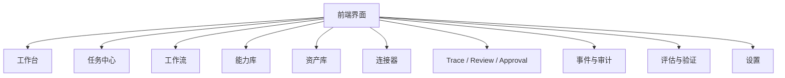

### 2.2 页面之间的关系

- 工作台是入口
- 任务中心是执行管理中心
- 工作流是编排中心
- 能力库是 Skill / Tool 管理中心
- 资产库是生产结果中心
- 连接器是运行状态中心
- Trace / Review / Approval 是审查中心
- 事件与审计是追踪中心
- 评估与验证是质量中心
- 设置是治理中心

### 2.3 目录填写规则

- 每个页面都先写“页面目标”
- 再写“页面组成”
- 再写“关键状态”
- 再写“图示预留”
- 最后写“待补内容”

---

## 3. 用户旅程图

### 3.1 旅程目标

用户从“进入产品”到“完成一次创意生产”，应该经历一条清晰、可解释、可回溯的路径。

### 3.2 旅程总图

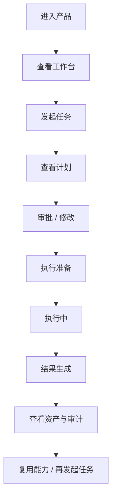

### 3.3 旅程阶段

- 进入
- 识别
- 计划
- 审批
- 执行
- 结果
- 复用

### 3.4 图示预留

- 任务提交卡片
- 计划确认弹窗
- 执行状态页
- 结果页
- 复用推荐区

---

## 4. 工作台 Home

### 4.1 页面目标

让用户一眼看到当前生产环境的整体状态。

### 4.2 页面组成

- 当前任务摘要
- 待审批事项
- 最近资产
- 最近失败
- Connector 健康状态
- 推荐能力
- 最近活动时间线

### 4.3 关键状态

- 空工作台
- 正常工作台
- 有审批待处理
- 有任务运行中
- 有连接异常

### 4.4 图示预留

- 首页布局图
- 首页状态图
- 首页空态图

### 4.5 首页布局图

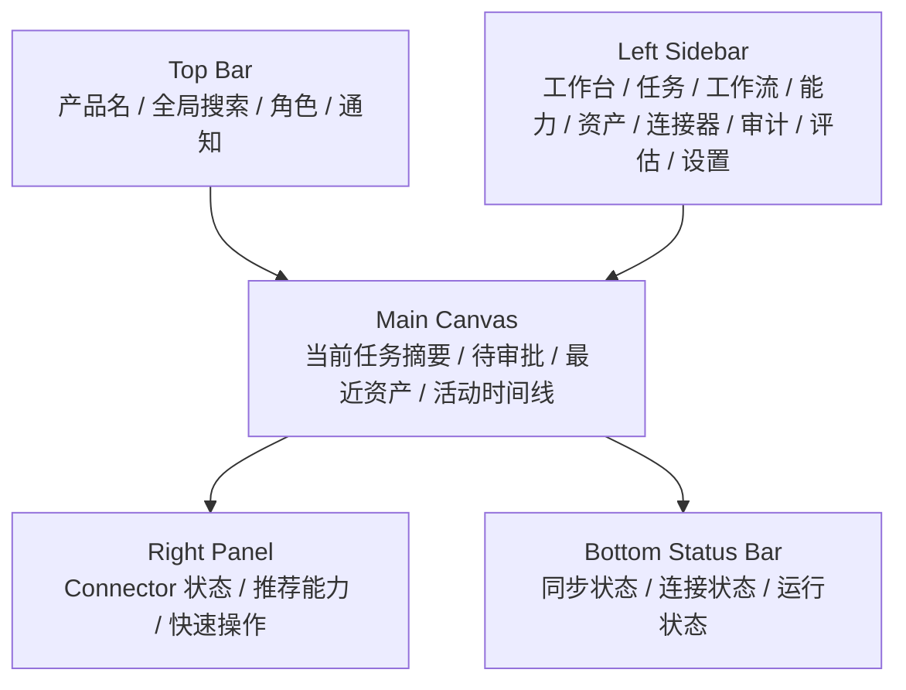

### 4.6 首页状态图

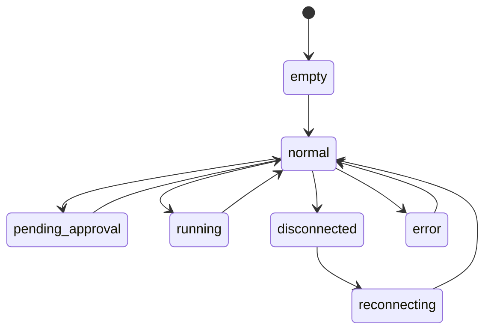

### 4.7 首页精修布局图

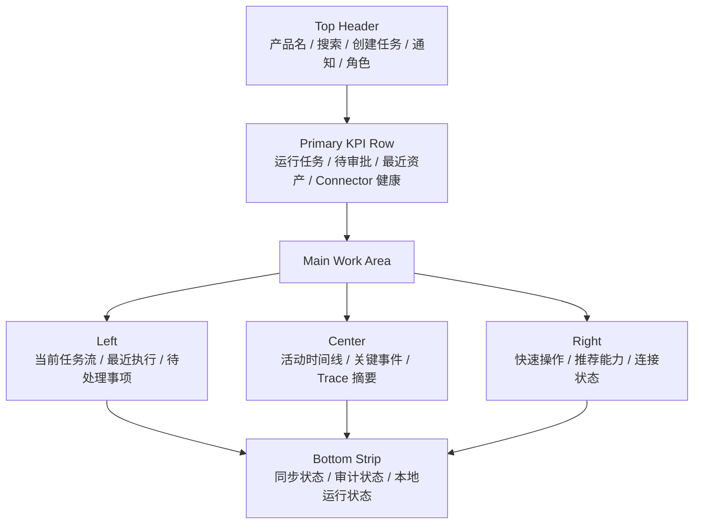

---

## 5. 任务中心

### 5.1 页面目标

管理所有任务的提交、执行、审批和恢复。

### 5.2 页面组成

- 任务列表
- 任务筛选
- 任务状态标签
- 执行进度
- 风险标记
- 审批标记

### 5.3 图示预留

- 任务列表图
- 任务筛选图
- 任务状态流图

### 5.4 任务列表图

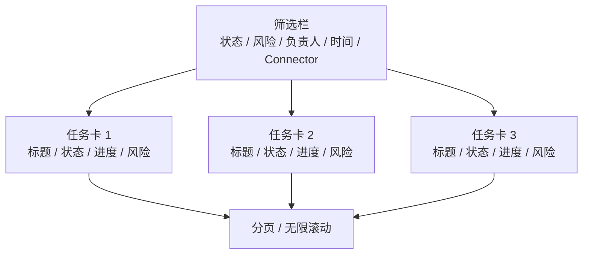

### 5.5 任务筛选图

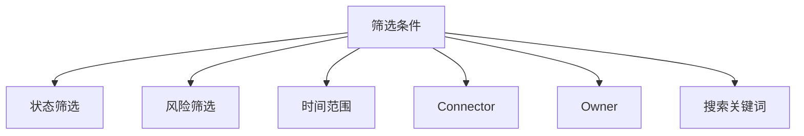

### 5.6 任务状态流图

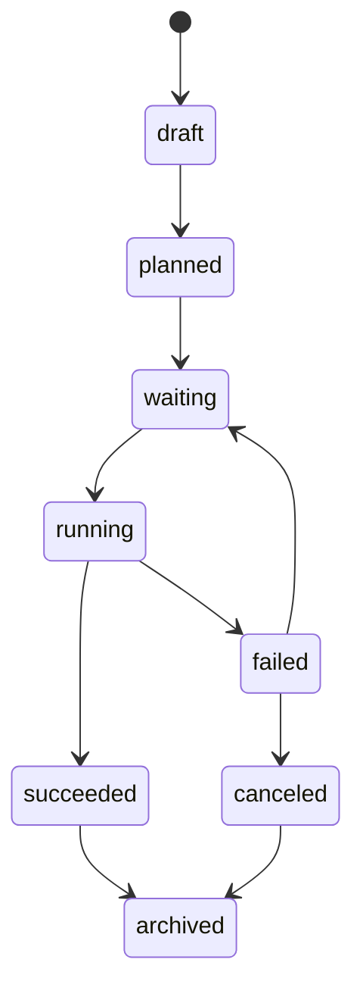

---

## 6. 任务详情页

### 6.1 页面目标

让用户看清一个任务从计划到执行的完整状态。

### 6.2 页面组成

- 任务标题
- 任务描述
- 当前状态
- 计划步骤
- 审批记录
- 执行记录
- 错误与恢复
- 关联资产

### 6.3 图示预留

- 任务详情页布局图
- 任务时间线图
- 任务错误卡片
- 任务审批卡片

### 6.4 任务详情页布局图

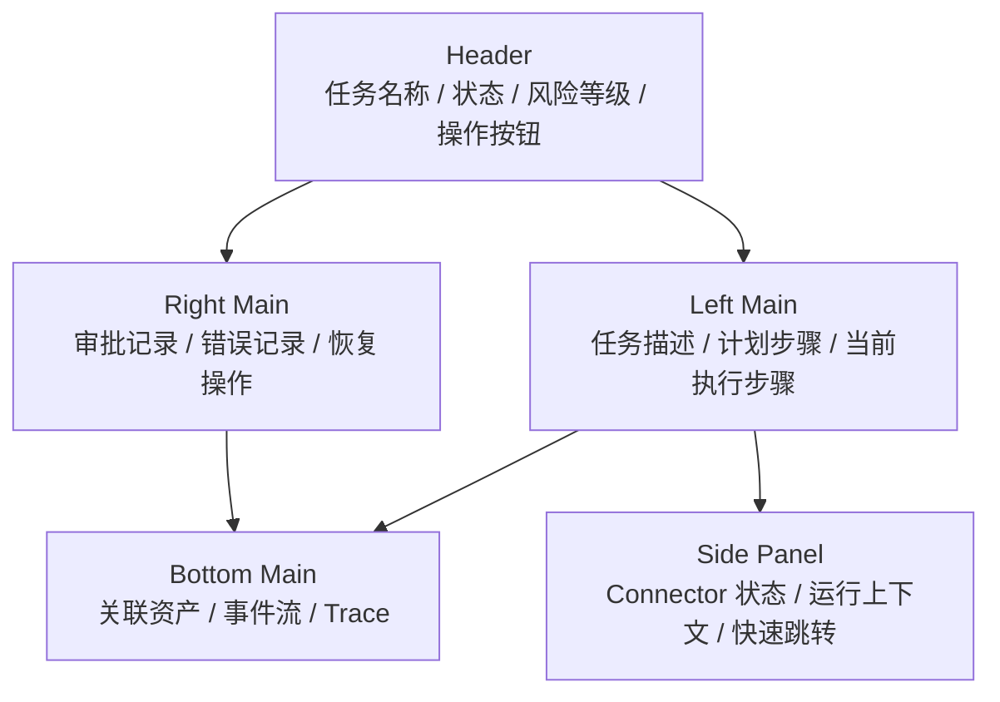

### 6.5 任务时间线图

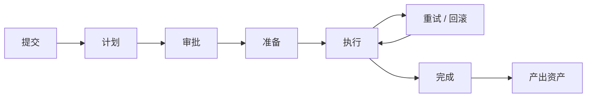

### 6.6 任务错误卡片

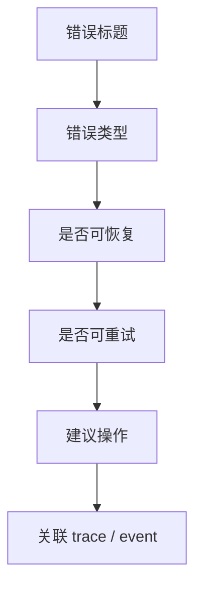

### 6.7 任务审批卡片

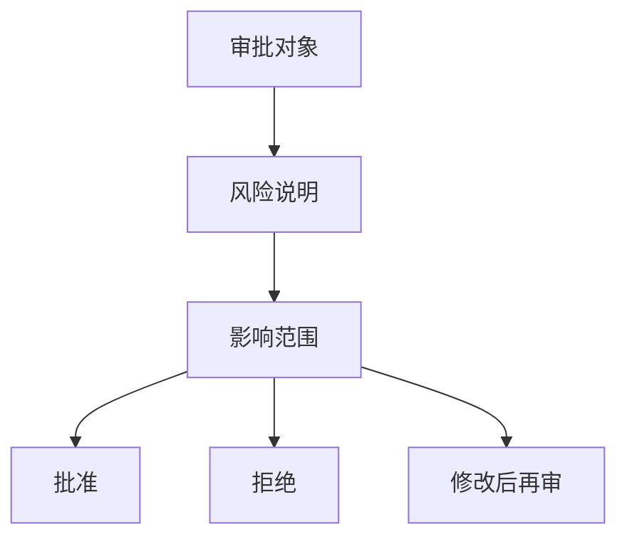

### 6.8 任务详情页精修布局图

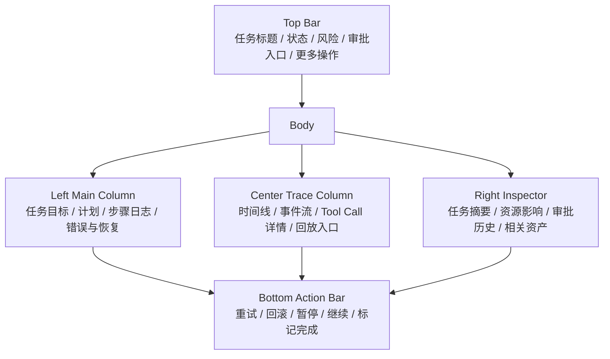

---

## 7. 工作流页

### 7.1 页面目标

展示和编辑 Workflow 的结构、节点、边和状态。

### 7.2 页面组成

- 工作流列表
- 工作流画布
- 节点面板
- 边面板
- 校验结果
- 运行记录

### 7.3 图示预留

- 工作流画布图
- 节点详情图
- 边契约图
- 工作流状态图

### 7.4 工作流画布图

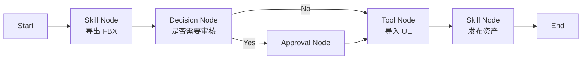

### 7.5 节点详情图

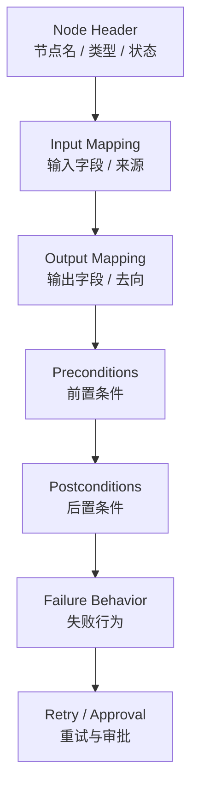

### 7.6 边契约图

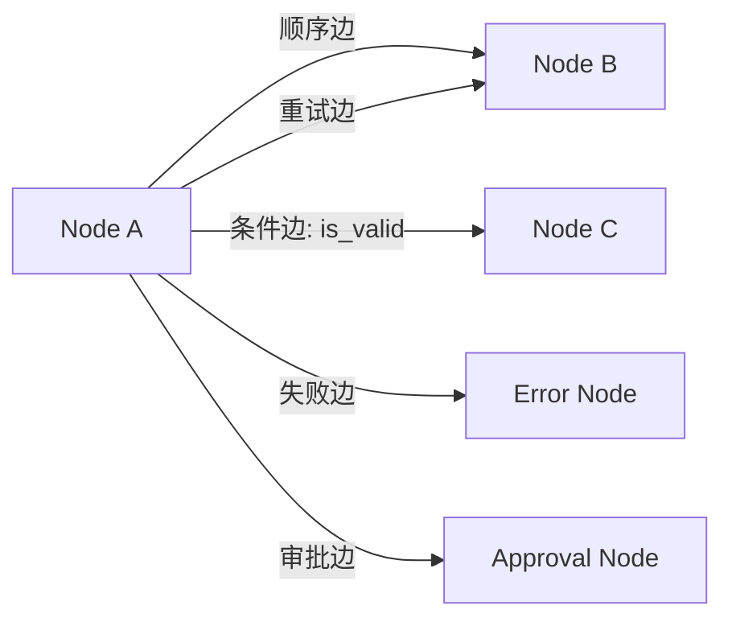

### 7.7 工作流状态图

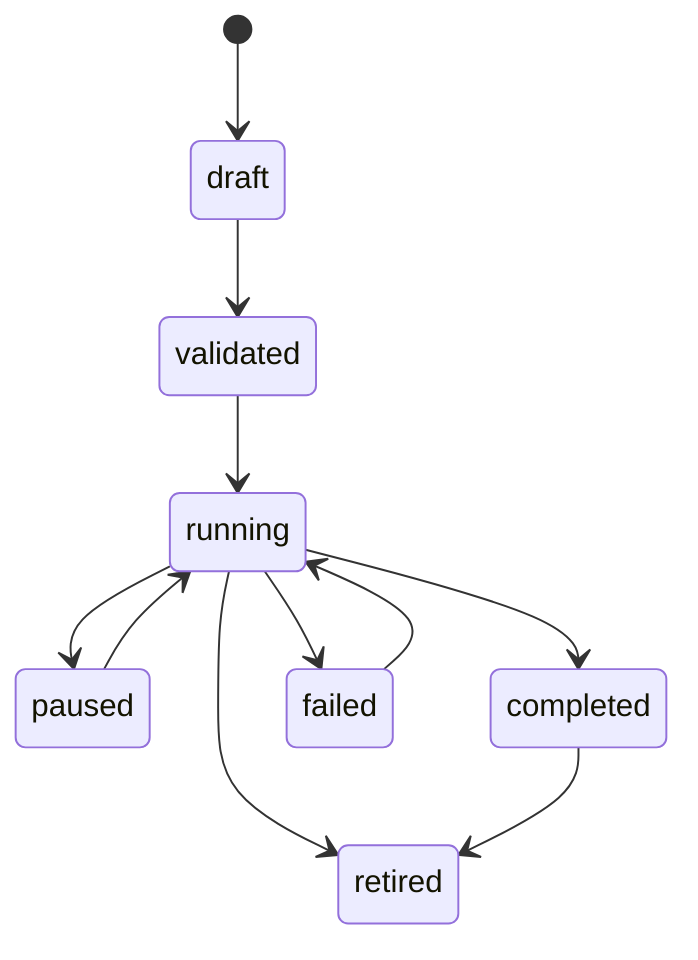

### 7.8 工作流精修画布图

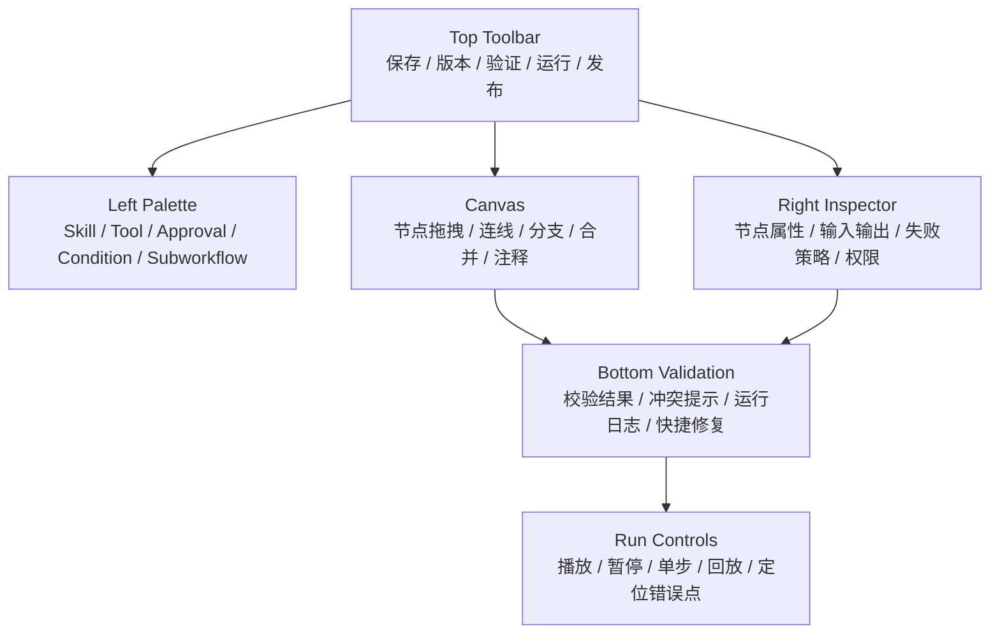

---

## 8. 能力库

### 8.1 页面目标

管理 Skill 和 Tool 的发现、注册、版本和生命周期。

### 8.2 页面组成

- Skill 列表
- Tool 列表
- Manifest 查看
- 版本信息
- 生命周期状态
- 权限需求

### 8.3 图示预留

- 能力库列表图
- Skill 详情页
- Tool 详情页
- 生命周期图

### 8.4 能力库列表图

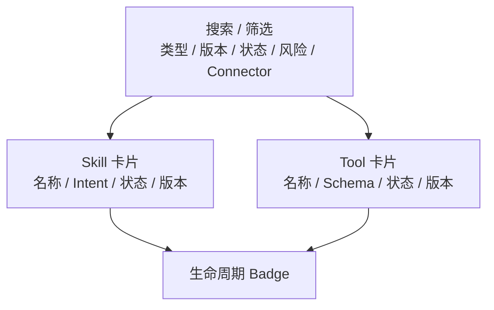

### 8.5 Skill 详情页

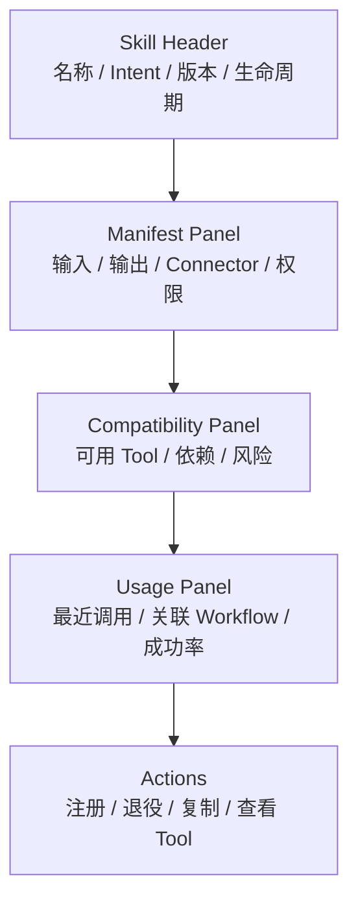

### 8.6 Tool 详情页

```mermaid
flowchart TD
  A["Tool Header<br/>名称 / Schema / 状态 / 幂等性"]
  B["Input Schema<br/>参数 / 校验 / 默认值"]
  C["Output Schema<br/>结果 / 错误语义"]
  D["Permission Panel<br/>权限 / 风险 / 确认要求"]
  E["Execution Info<br/>最近执行 / 失败率 / 版本"]
  A --> B --> C --> D --> E
```

### 8.7 生命周期图

```mermaid
stateDiagram-v2
  [*] --> draft
  draft --> registered
  registered --> validated
  validated --> available
  available --> deprecated
  deprecated --> disabled
  disabled --> retired
  available --> disabled
```

---

## 9. 资产库

### 9.1 页面目标

管理生产结果、版本、来源链和发布状态。

### 9.2 页面组成

- 资产列表
- 资产筛选
- 资产预览
- 资产详情
- 来源追溯
- 版本历史
- 发布状态
- 关联任务
- 差异对比
- 发布记录

### 9.3 图示预留

- 资产列表图
- 资产详情页
- 来源追溯图
- 资产版本图
- 资产预览图
- 资产差异图

### 9.4 资产列表图

```mermaid
flowchart TD
  A["搜索 / 筛选<br/>类型 / 版本 / 状态 / 来源 / 发布时间"]
  B["Asset Card 1<br/>预览缩略图 / 名称 / 发布状态"]
  C["Asset Card 2<br/>预览缩略图 / 名称 / 发布状态"]
  D["Asset Card 3<br/>预览缩略图 / 名称 / 发布状态"]
  E["分页 / 分组 / 收藏"]

  A --> B
  A --> C
  A --> D
  B --> E
  C --> E
  D --> E
```

### 9.5 页面体验原则

- 先看结果，再看元数据
- 预览必须快速可见
- 来源链必须可追踪
- 版本必须可对比
- 发布状态必须显式

### 9.6 资产预览图

```mermaid
flowchart TD
  A["主预览"]
  B["缩略图切换"]
  C["视图模式<br/>2D / 3D / 时间线 / 层级"]
  D["放大 / 对比 / 标记"]
  A --> B --> C --> D
```

### 9.7 资产差异图

```mermaid
flowchart LR
  A["版本 A"] --> C["Diff Viewer"]
  B["版本 B"] --> C
  C --> D["变化高亮"]
  C --> E["结构差异"]
  C --> F["元数据差异"]
```

### 9.8 资产版本图

```mermaid
flowchart TD
  A["V1"] --> B["V2"]
  B --> C["V3"]
  C --> D["V4"]
  B --> E["回滚点"]
  C --> F["当前版本"]
```

### 9.9 资产详情页图

```mermaid
flowchart TD
  A["Asset Header<br/>预览图 / 名称 / 版本 / 发布状态"]
  B["Preview Panel<br/>主预览 / 缩略图 / 切换视图"]
  C["Metadata Panel<br/>类型 / 来源 / 生成者 / 时间"]
  D["Provenance Panel<br/>来源追溯 / 关联任务 / trace"]
  E["Version Panel<br/>版本历史 / 差异对比 / 回滚"]
  F["Actions<br/>发布 / 撤回 / 标记 / 导出"]

  A --> B
  A --> C
  B --> D
  C --> E
  D --> F
```

### 9.10 资产详情页精修布局图

```mermaid
flowchart TD
  A["Top Bar<br/>资产名称 / 当前版本 / 发布状态 / 对比切换 / 操作菜单"]
  B["Main Workspace"]
  C["Left Preview Column<br/>大图预览 / 缩略图 / 多视角切换 / 播放控件"]
  D["Center Provenance Column<br/>来源链 / 关联任务 / 生成事件 / 审批记录 / 回放入口"]
  E["Right Version Column<br/>版本列表 / 差异对比 / 回滚 / 发布历史"]
  F["Bottom Action Bar<br/>发布 / 撤回 / 导出 / 标记 / 添加备注"]

  A --> B
  B --> C
  B --> D
  B --> E
  C --> F
  D --> F
  E --> F
```

### 9.6 来源追溯图

```mermaid
flowchart LR
  A["源文件"] --> B["Skill"]
  B --> C["Workflow"]
  C --> D["Task"]
  D --> E["Asset"]
  E --> F["Published Version"]
```

---

## 10. 连接器面板

### 10.1 页面目标

让用户看到当前 DCC 连接状况和能力可用性。

### 10.2 页面组成

- Connector 列表
- 连接状态
- 健康状态
- 可用能力
- 重连操作
- 日志摘要

### 10.3 图示预留

- Connector 面板图
- 健康状态图
- 断线提示图

### 10.4 Connector 面板图

```mermaid
flowchart TD
  A["Connector Header<br/>名称 / 状态 / 健康度 / 重连按钮"]
  B["Capability List<br/>可用能力 / 版本 / 权限"]
  C["Session Binding<br/>当前会话 / DCC 绑定"]
  D["Health Panel<br/>延迟 / 最近错误 / 重连历史"]
  E["Logs Panel<br/>连接日志 / 调试日志"]

  A --> B
  A --> C
  B --> D
  C --> E
```

### 10.5 连接健康状态图

```mermaid
stateDiagram-v2
  [*] --> disconnected
  disconnected --> connecting
  connecting --> connected
  connected --> degraded
  degraded --> reconnecting
  reconnecting --> connected
  connected --> disconnected
  degraded --> disconnected
```

### 10.6 断线提示图

```mermaid
flowchart TD
  A["连接异常"] --> B["提示原因"]
  B --> C["自动重连"]
  B --> D["手动重连"]
  B --> E["切换 Connector"]
  C --> F["恢复执行"]
  D --> F
  E --> F
```

---

## 11. 事件与审计

### 11.1 页面目标

为用户提供可追踪、可回放、可审计的行为记录。

### 11.2 页面组成

- 事件流
- Trace 时间线
- 审计记录
- 错误记录
- 回放入口

### 11.3 图示预留

- 事件流列表图
- Trace 时间线图
- 审计详情页

### 11.4 事件流列表图

```mermaid
flowchart TD
  A["Filter Bar<br/>时间 / Session / Task / Level / Source"]
  B["Event Row 1<br/>时间 / 事件名 / 状态 / 来源"]
  C["Event Row 2<br/>时间 / 事件名 / 状态 / 来源"]
  D["Event Row 3<br/>时间 / 事件名 / 状态 / 来源"]
  E["事件详情抽屉"]

  A --> B
  A --> C
  A --> D
  B --> E
  C --> E
  D --> E
```

### 11.5 审计详情页

```mermaid
flowchart TD
  A["Audit Header<br/>对象 / 操作人 / 时间 / 结果"]
  B["Action Summary<br/>做了什么"]
  C["Policy Match<br/>触发了哪条策略"]
  D["Trace Link<br/>关联 trace / event"]
  E["Result<br/>批准 / 拒绝 / 过期"]
  A --> B --> C --> D --> E
```

---

## 12. Trace / Review / Approval

### 12.1 页面目标

让用户审查 AI 的计划、工具调用和审批请求，并在关键点介入。

### 12.2 页面组成

- Review 队列
- Approval 队列
- Trace 时间线
- Tool Call 详情
- 风险说明
- 批准 / 拒绝 / 修改入口
- 回放控制

### 12.3 页面体验原则

- 用户先看结论，再看过程
- 风险优先展示
- 审批动作必须明确
- 回放必须可读
- 每一步都要有责任归属

### 12.4 关键状态

- 待审查
- 待审批
- 处理中
- 已批准
- 已拒绝
- 已过期
- 已回放

### 12.5 图示预留

- Review 队列图
- Approval Drawer 图
- Trace 时间线图
- Tool Call 详情图
- 回放控制图

### 12.6 Review 队列图

```mermaid
flowchart TD
  A["待处理队列"] --> B["高风险任务"]
  A --> C["待审批 Tool Call"]
  A --> D["待复核 Trace"]
  B --> E["审批人处理"]
  C --> E
  D --> E
```

### 12.7 Approval Drawer 图

```mermaid
flowchart TD
  A["审批标题"]
  B["风险说明"]
  C["影响范围"]
  D["调用详情"]
  E["批准"]
  F["拒绝"]
  G["要求修改"]
  A --> B --> C --> D --> E
  C --> F
  C --> G
```

### 12.8 Trace 时间线图

```mermaid
flowchart LR
  A["Request"] --> B["Plan"]
  B --> C["Approval"]
  C --> D["Tool Call"]
  D --> E["Connector"]
  E --> F["DCC"]
  F --> G["Event"]
  G --> H["Artifact"]
```

### 12.9 回放控制图

```mermaid
flowchart TD
  A["选择 Trace"] --> B["播放"]
  B --> C["暂停"]
  C --> D["单步"]
  C --> E["快进"]
  C --> F["跳转到错误点"]
  F --> C
```

### 12.10 Trace / Review / Approval 精修布局图

```mermaid
flowchart TD
  A["顶部栏<br/>Trace 标题 / 风险等级 / 审批状态 / 快捷操作"]
  B["主内容区"]
  C["左侧队列栏<br/>Review 队列 / Approval 队列 / 待处理项 / 优先级"]
  D["中间 Trace 区<br/>请求 / 计划 / Tool Call / Connector / DCC / Artifact"]
  E["右侧审查抽屉<br/>风险说明 / 影响范围 / 审批建议 / 审批记录"]
  F["底部回放栏<br/>播放 / 暂停 / 单步 / 跳转 / 回到关键点"]
  G["操作区<br/>批准 / 拒绝 / 修改后再审 / 请求人工介入"]

  A --> B
  B --> C
  B --> D
  B --> E
  C --> F
  D --> F
  E --> G
  F --> G
```

---

## 13. 评估与验证

### 13.1 页面目标

展示能力、工作流和连接器的质量结果。

### 13.2 页面组成

- 基准用例
- 回归结果
- 沙箱测试
- 红线测试
- 评分与报告

### 13.3 图示预留

- 评估仪表盘
- 测试结果页
- 回归对比图

### 13.4 评估仪表盘

```mermaid
flowchart TD
  A["摘要卡片<br/>成功率 / 回归通过率 / 人工介入率 / 失败率"]
  B["基准用例列表"]
  C["回归趋势<br/>版本趋势 / 波动"]
  D["沙箱结果"]
  E["红线警告"]

  A --> B
  A --> C
  A --> D
  A --> E
```

### 13.5 测试结果页

```mermaid
flowchart TD
  A["测试名称 / 版本 / 环境"]
  B["通过 / 失败摘要"]
  C["失败案例"]
  D["Diff / 回归"]
  E["Artifacts"]
  F["重新运行"]

  A --> B --> C --> D --> E --> F
```

### 13.6 回归对比图

```mermaid
flowchart LR
  A["旧版本"] --> C["Diff"]
  B["新版本"] --> C
  C --> D["界面差异"]
  C --> E["行为差异"]
  C --> F["事件差异"]
```

---
## 14. 设置与权限

### 14.1 页面目标

管理用户、权限、通知、版本和连接设置。

### 14.2 页面组成

- 用户与权限
- 连接设置
- 审计策略
- 版本策略
- 通知策略
- 角色视图
- 可见性策略

### 14.3 图示预留

- 设置首页
- 权限配置页
- 通知配置页
- 角色切换图

### 14.4 设置首页

```mermaid
flowchart TD
  A["Settings Home"]
  B["用户与权限"]
  C["连接设置"]
  D["审计策略"]
  E["版本策略"]
  F["通知策略"]
  G["角色与可见性"]

  A --> B --> C --> D --> E --> F --> G
```

### 14.5 权限配置页

```mermaid
flowchart TD
  A["Role / User / Scope"]
  B["Permission Matrix"]
  C["Risk Levels"]
  D["Approval Rules"]
  E["Save / Preview"]
  A --> B --> C --> D --> E
```

### 14.6 通知配置页

```mermaid
flowchart TD
  A["Channels<br/>Web / Email / System"]
  B["Event Subscriptions"]
  C["Approval Alerts"]
  D["Failure Alerts"]
  E["Digest Settings"]
  A --> B --> C --> D --> E
```

---

## 15. 状态页与空态

### 15.1 页面目标

统一定义加载中、空数据、错误、恢复中的 UI 处理方式。

### 15.2 状态分类

- 空态
- 加载中
- 部分可用
- 错误态
- 恢复中
- 无权限
- 断连

### 15.3 图示预留

- 空工作台图
- 空任务图
- 加载中图
- 错误页图
- 无权限图

### 15.4 空工作台图

```mermaid
flowchart TD
  A["空状态插图 / 提示语"]
  B["开始任务按钮"]
  C["导入连接器按钮"]
  D["查看示例工作流"]
  A --> B --> C --> D
```

### 15.5 加载中图

```mermaid
flowchart TD
  A["Skeleton Card"]
  B["Skeleton Timeline"]
  C["Progress Indicator"]
  A --> B --> C
```

### 15.6 错误页图

```mermaid
flowchart TD
  A["错误标题"]
  B["错误说明"]
  C["错误代码"]
  D["重试"]
  E["返回工作台"]
  A --> B --> C --> D --> E
```

### 15.7 无权限图

```mermaid
flowchart TD
  A["无权限提示"]
  B["需要的权限"]
  C["申请权限"]
  D["联系管理员"]
  A --> B --> C --> D
```

---

## 16. 响应式与布局规范

### 16.1 布局原则

- 桌面优先
- 大屏友好
- 控制台布局
- 多面板可切换
- 信息密度可调

### 16.2 布局区块

- 顶栏
- 侧栏
- 主内容区
- 右侧详情区
- 底部状态区

### 16.3 图示预留

- 桌面布局图
- 分栏布局图
- 窄屏降级图

---

## 17. 设计系统 / 组件目录

### 17.1 页面目标

统一前端组件语言，避免页面越多、风格越散。

### 17.2 组件目录

- Task Card
- Approval Drawer
- Trace Row
- Asset Card
- Connector Status Chip
- Error Banner
- Workflow Node
- Run Timeline
- Preview Panel
- State Badge
- Risk Badge
- Action Bar
- Empty State

### 17.3 组件规范字段

每个组件 SHOULD 至少定义：

- 用途
- 适用场景
- 状态
- 交互
- 尺寸
- 可变体
- 是否可复用

### 17.4 图示预留

- 组件总览图
- 卡片族图
- 状态 Badge 图
- 面板布局图

---

## 18. 页面状态矩阵

### 18.1 页面目标

统一定义各页面在不同运行状态下应该怎么显示。

### 18.2 通用状态

- normal
- loading
- empty
- disconnected
- error
- partial
- pending_approval
- running
- read_only
- forbidden

### 18.3 页面状态矩阵

| 页面 | loading | empty | error | pending_approval | running | read_only |
| --- | --- | --- | --- | --- | --- | --- |
| 工作台 | 是 | 是 | 是 | 是 | 是 | 是 |
| 任务中心 | 是 | 是 | 是 | 是 | 是 | 是 |
| 任务详情页 | 是 | 是 | 是 | 是 | 是 | 是 |
| 工作流页 | 是 | 是 | 是 | 否 | 是 | 是 |
| 能力库 | 是 | 是 | 是 | 否 | 否 | 是 |
| 资产库 | 是 | 是 | 是 | 否 | 否 | 是 |
| Connector 面板 | 是 | 是 | 是 | 否 | 是 | 是 |
| Trace / Review / Approval | 是 | 是 | 是 | 是 | 是 | 是 |
| 事件与审计 | 是 | 是 | 是 | 否 | 否 | 是 |
| 评估与验证 | 是 | 是 | 是 | 否 | 否 | 是 |

### 18.4 图示预留

- 页面状态矩阵图
- 关键页面状态卡图
- 空态与错误态图

---

## 19. 角色与权限视图

### 19.1 页面目标

让不同角色看到不同的信息和操作面，避免前端臃肿和权限泄露。

### 19.2 角色类型

- 操作员
- 审批人
- 管理员
- 调试者
- 观察者
- Pipeline Owner

### 19.3 角色差异

- 操作员优先看任务和资产
- 审批人优先看 Review / Approval
- 管理员优先看设置与治理
- 调试者优先看 Trace / Event / Connector
- 观察者优先看只读视图

### 19.4 图示预留

- 角色切换图
- 权限可见性图
- 不同角色首页对比图

---

## 20. 图示索引

### 20.1 已预留图示

- 总体信息架构图
- 用户旅程图
- 首页布局图
- 任务详情页图
- 工作流画布图
- 能力库图
- 资产库图
- Connector 面板图
- 事件与审计图
- 评估仪表板图
- 测试结果页图
- 回归对比图
- 设置页图
- 权限配置页图
- 通知配置页图
- 状态页图
- Trace / Review / Approval 图
- 组件总览图
- 页面状态矩阵图
- 角色视图图
- 任务列表图
- 任务筛选图
- 任务状态流图
- 能力库列表图
- Skill 详情页图
- Tool 详情页图
- 生命周期图
- 资产预览图
- 资产差异图
- 资产版本图
- 事件流列表图
- 审计详情页图
- 空工作台图
- 加载中图
- 错误页图
- 无权限图

### 20.2 待填充图示优先级

1. 首页
2. 任务详情页
3. 工作流画布
4. 资产库
5. Trace / Review / Approval
6. 任务中心
7. 能力库
8. 事件与审计
9. 连接器面板
10. 评估与验证
11. 组件目录
12. 页面状态矩阵
13. 角色与权限视图
14. 状态页与空态

---

## 21. 待补内容

- 每个页面的具体布局草图
- 每个页面的交互状态
- 组件级规范
- 颜色与视觉风格
- 交互动效规范
- 设计系统组件映射
- 页面级权限差异图
- Trace / Review / Approval 交互草图
- 资产详情页的 provenance 视图


